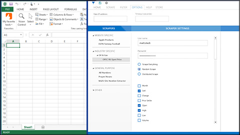
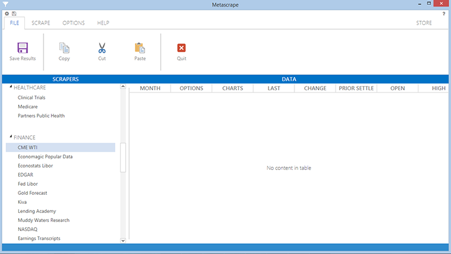
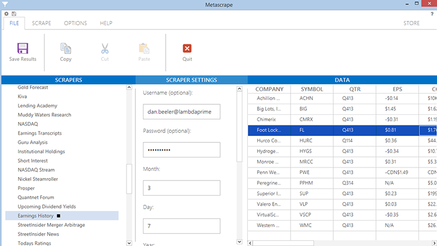

Metascrape is an internet scrapper. The target audience of this application is law enforcement, marketing companies, etc.

The user could configure what to scrap for on the internet and the interface changed dynamically according to which module 
the user had selected from the marketplace. Each module had a specific target audience/market.

This application was created in 2014. It uses [JMetro](https://pixelduke.com/java-javafx-theme-jmetro/) and [FXRibbon](https://pixelduke.com/fxribbon/).

