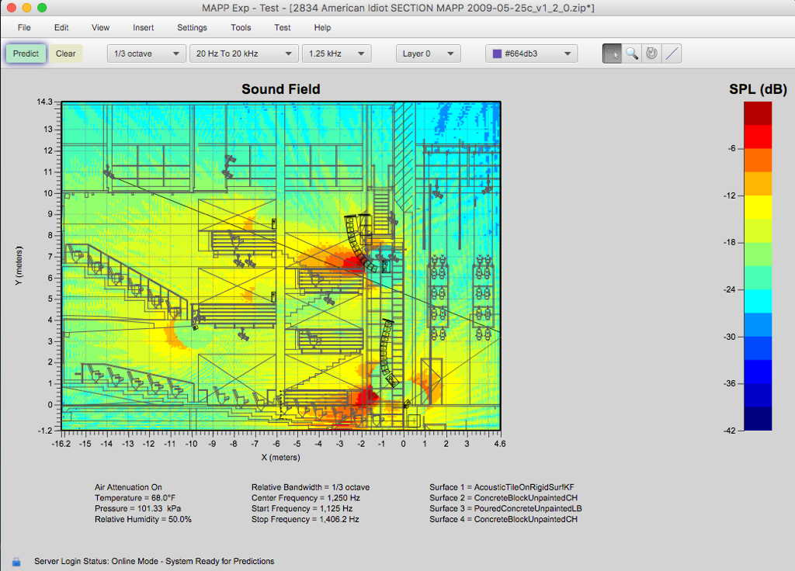
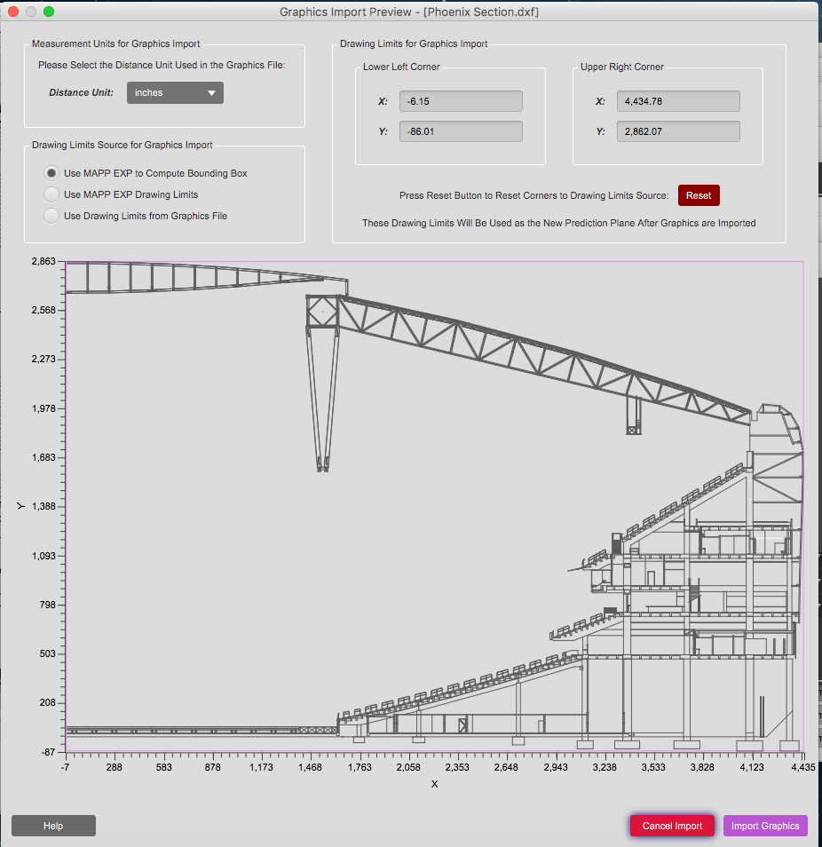
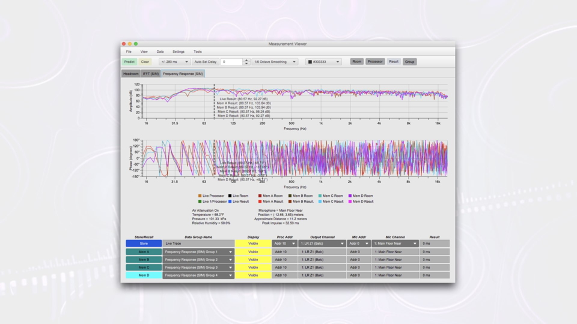
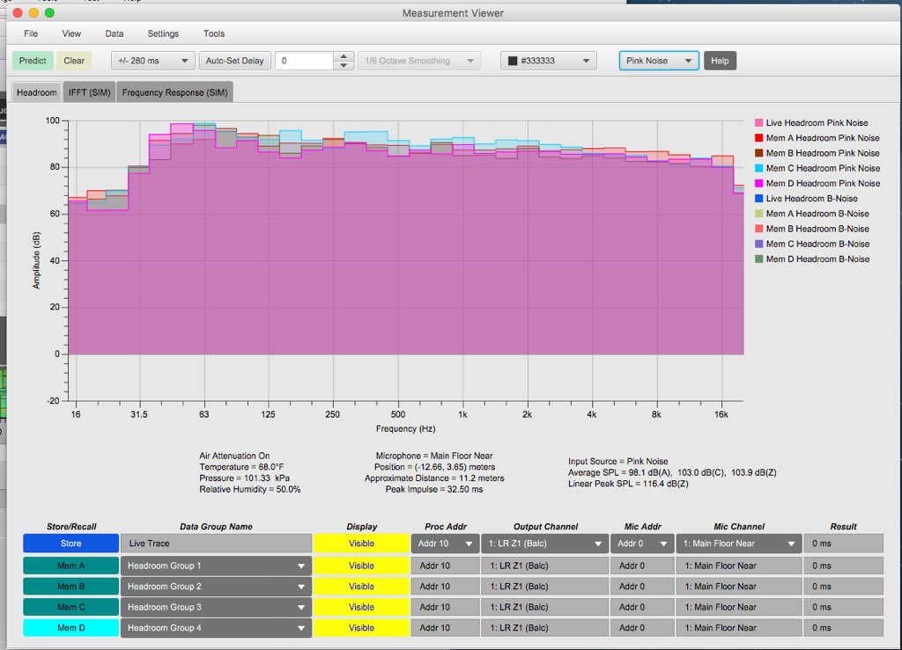

An audio coverage planning wsoftware: sculpt your coverage pattern and sharpen design ideas with your team online or offline before setting foot in a venue, so you save time, cost, and stress.
Skip the guesswork with a level of prediction accuracy that is only possible when combining sophisticated algorithms with high-resolution loudspeaker data and box-to-box consistency.
The measurements in MAPP XT are independently verifiable and highly precise (1/24th octave frequency resolution), so users can trust that their predictions will closely match the results onsite.

