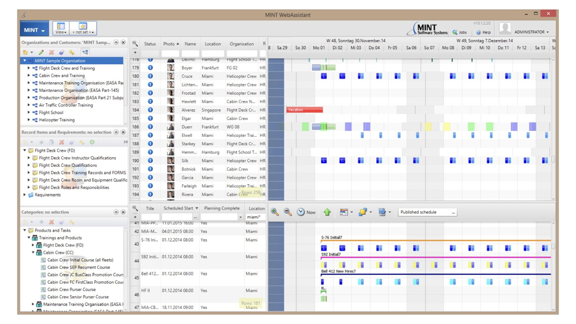
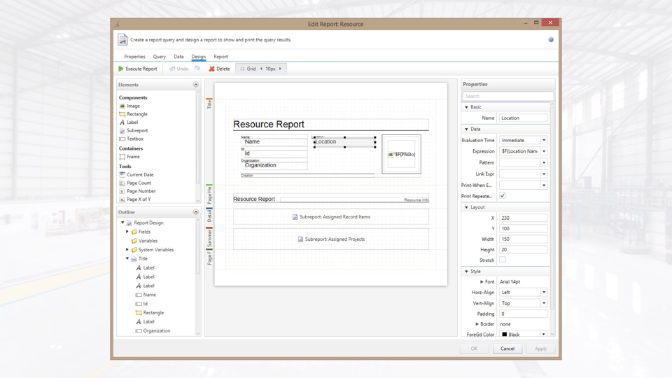
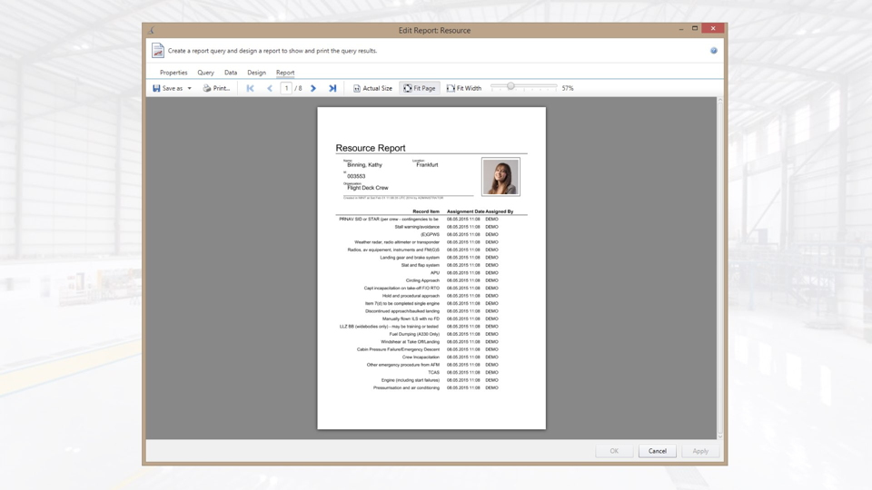
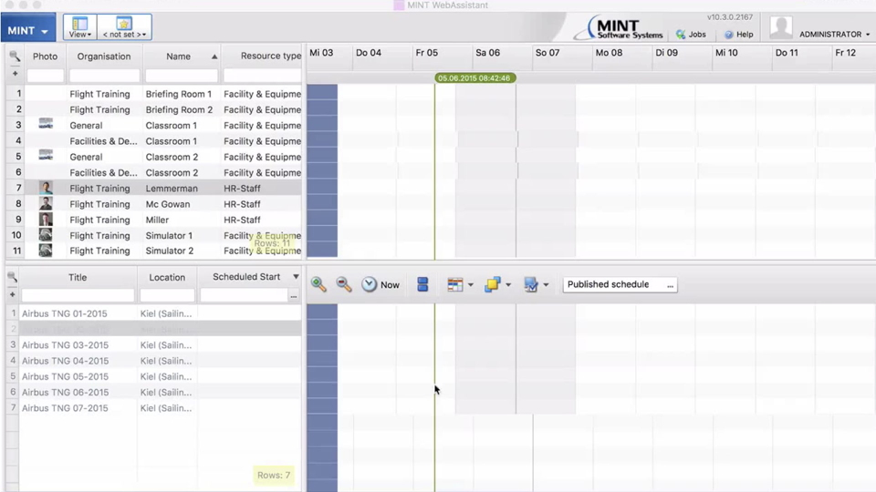

MINT TRMS is used by Airlines to schedule and administrate the training for its personnel.Training requirements are captured and allocated to the available resources. This is a very important topic in the aviation domain, as only qualified personnel is allowed to maintain or fly aircrafts. This client / server application had complex lazy loading requirements which could all be solved by using JavaFX.

