- Prototype of a fully JavaFX-based General-Aviation flight planning software.
- Testbed for new concepts in flight management, data management and flight planning.
- Special version used by "Deutscher Aeroclub" DAeC to validate airspace data.
- Mobile version for flight operation.
- Web version for community interaction.

#### Overall design

- Map-centric
- Flexible tabs at all sides of the window
- Inspired by IntelliJ IDEA
- Main working areas:
- Data management
- Flight planning
- Flight operation

#### Flight planning
- Graphical and tabular route editing
- Route animation
- Profile view showing terrain, airspaces and route

#### Data management
- Load data from different sources
- Analyse data via flexible map layers

#### Flight operation (Mobile)
- Re-use code from desktop version
- Latest (offline) maps
- Position reporting (MQTT/LTE)
- Surveillance (OGN/LTE)

#### Community interaction (Web)
- Re-use code from desktop version
- Latest maps and data

### Desktop Screenshots

[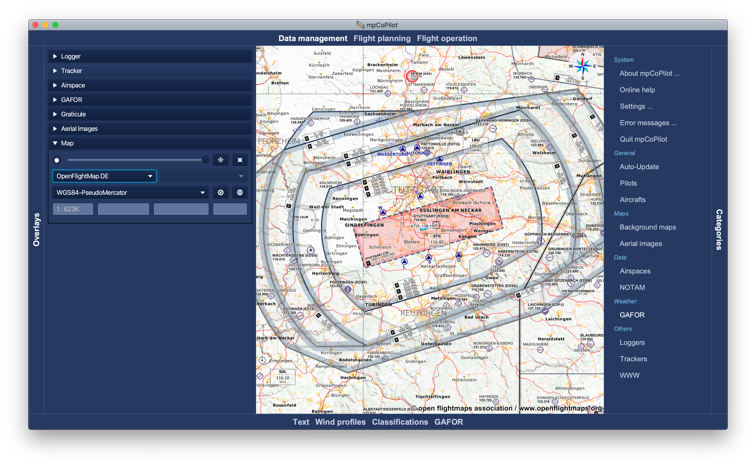]()

[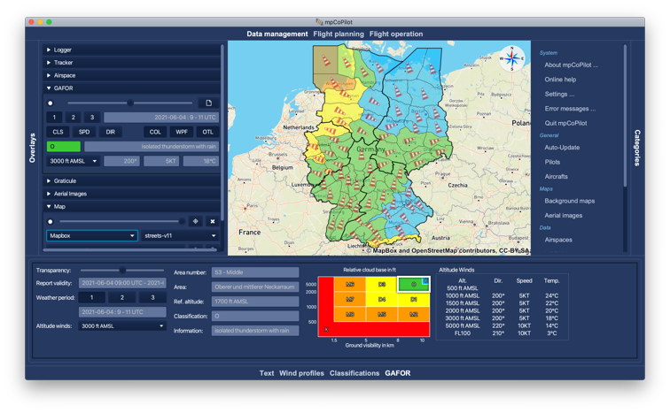]()

[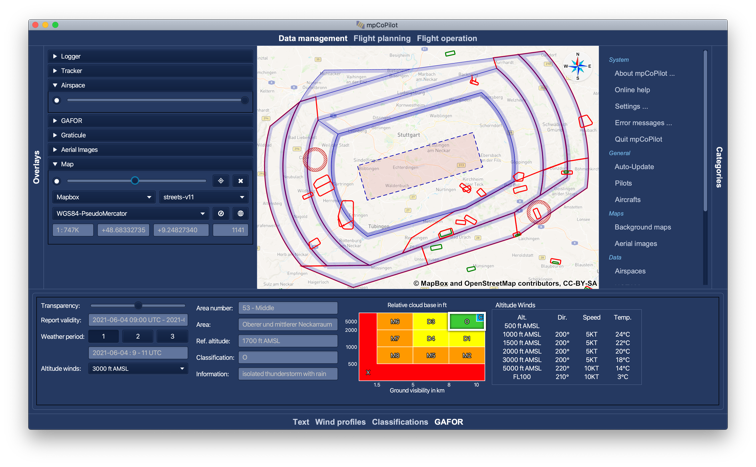]()

[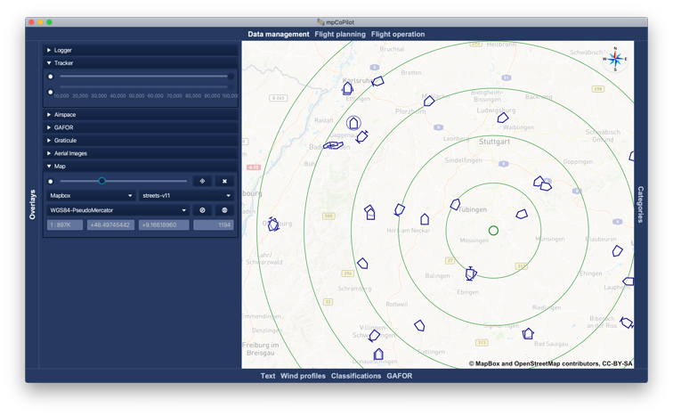]()

[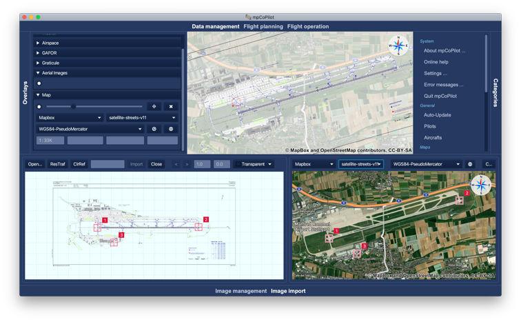]()

[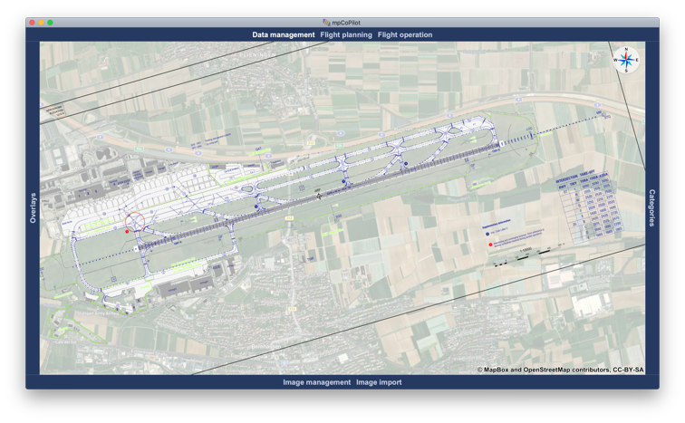]()

[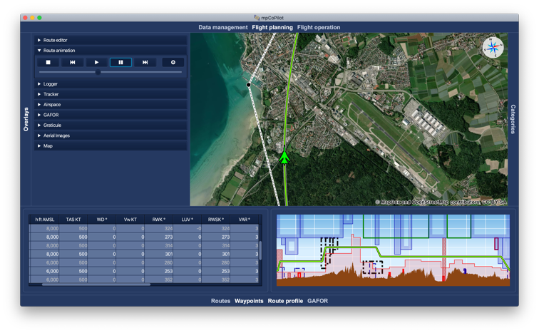]()

### Web

The client is identical to the desktop client. Deployment to the web via JPro.

[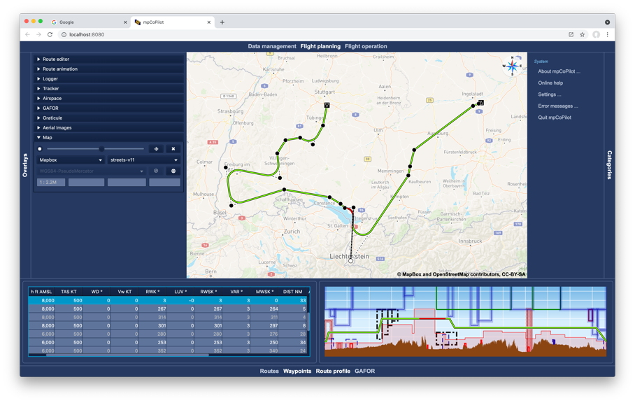]()

### Mobile

[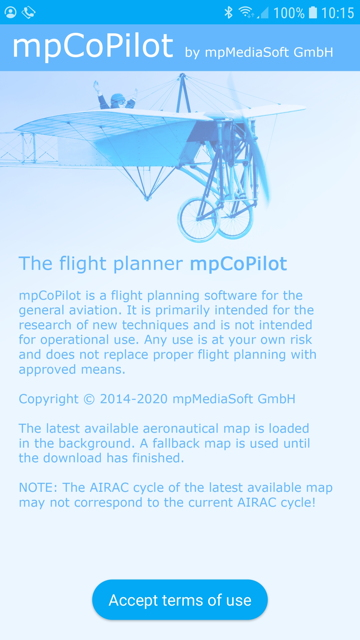]()

[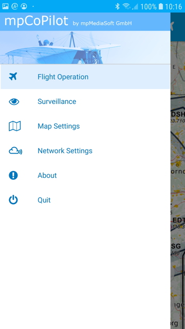]()

[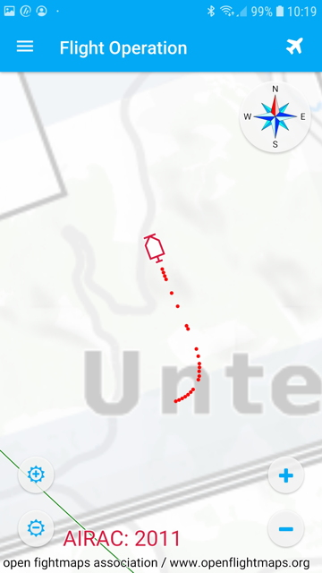]()

