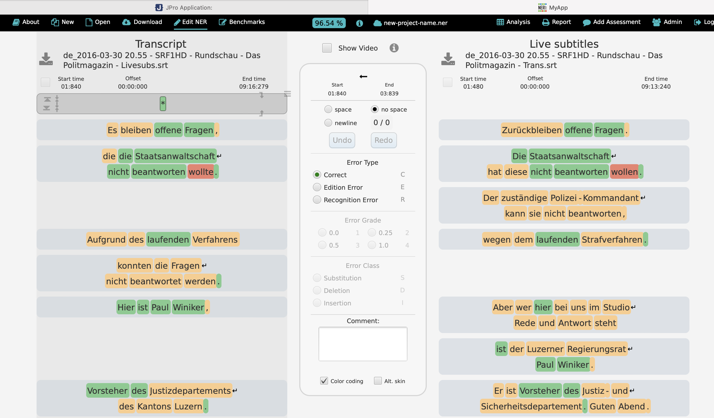
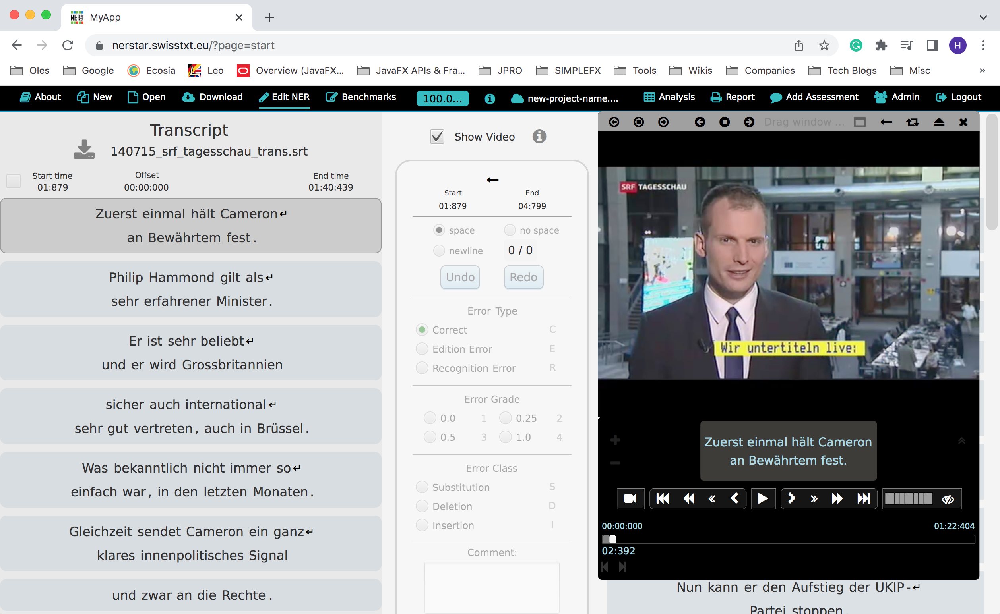
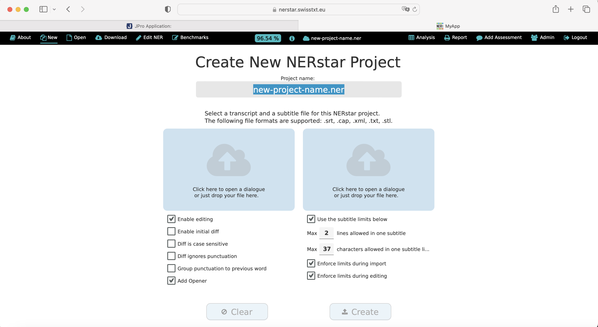

NERstar is a cross platform media application, running on desktops and in all common desktop web browsers (with [JPro](https://www.jpro.one/)),
with one and the same source code.
It is used for the handling of subtitles for Live Television.
The application was developed by the SANDEC team in cooperation with SWISS TXT, a Swiss State Television company.

