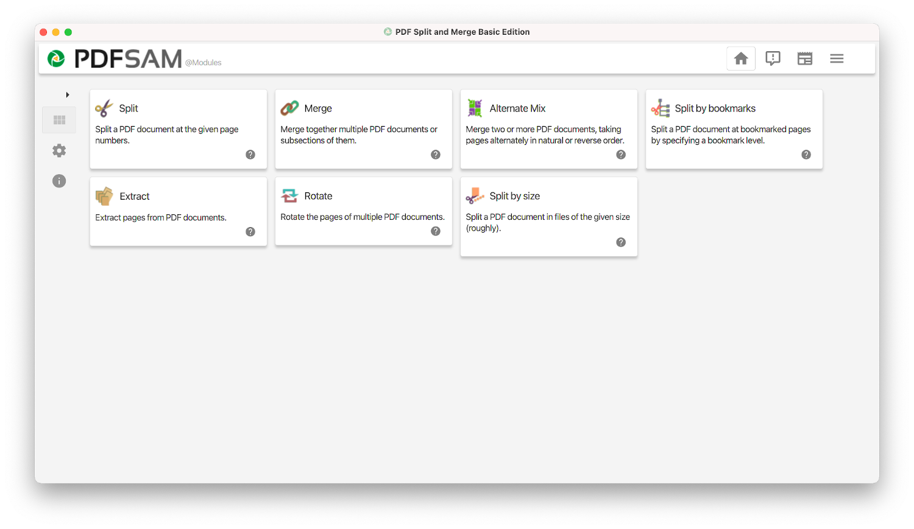
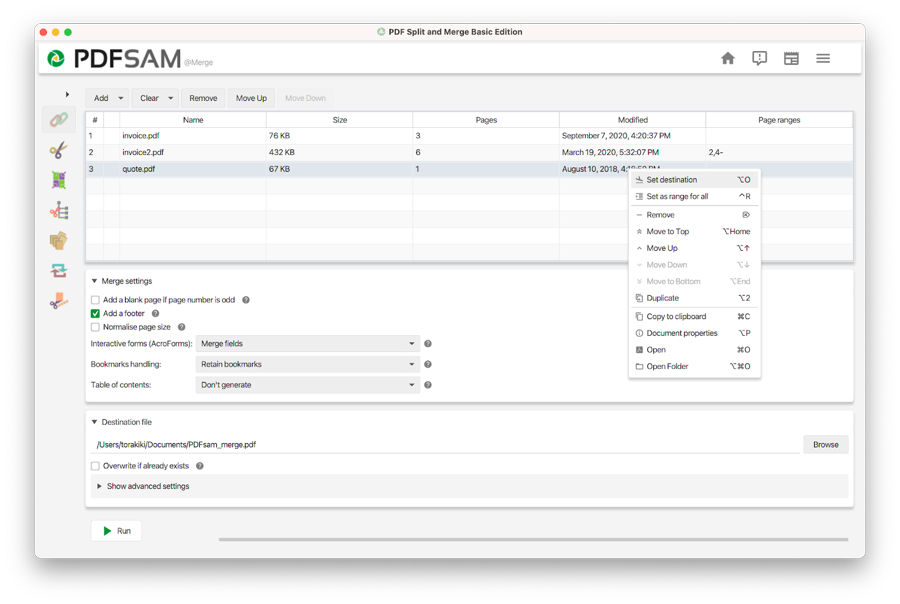
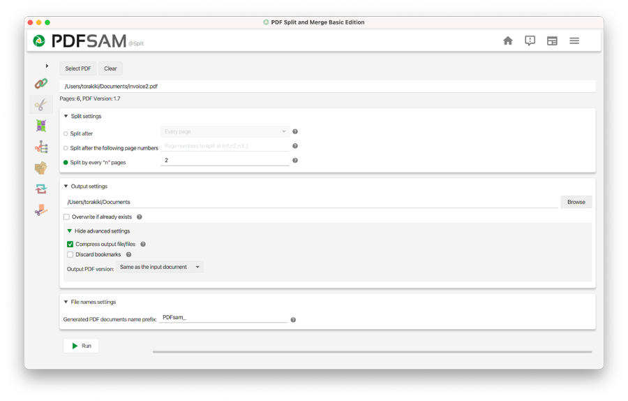

PDFsam Basic is a free and open source application that allows you to split, merge, rotate, alternately mix and extract pages from PDF files.

Designed to be simple and intuitive, it allows to perform most of the PDF-related tasks one may need in the day-to-day office business, all with an unparalleled variety of options to cover all edge cases.

Battle tested by around half a million users every day, PDFsam Basic processes your PDF documents locally, on your computer without them being sent to any third party service.

> PDFsam Basic is Free and Open Source Software, under the [GNU Affero General Public License v3 terms](https://www.gnu.org/licenses/agpl-3.0.html).  
> Source code and the issue tracker at [https://github.com/torakiki/pdfsam](https://github.com/torakiki/pdfsam)  
> More information and download links are available at [https://pdfsam.org/pdfsam-basic/](https://pdfsam.org/pdfsam-basic/)
