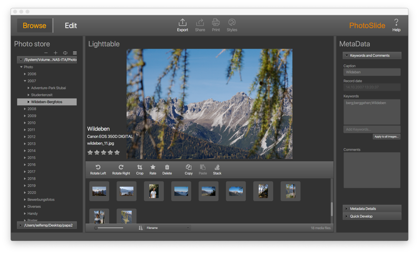
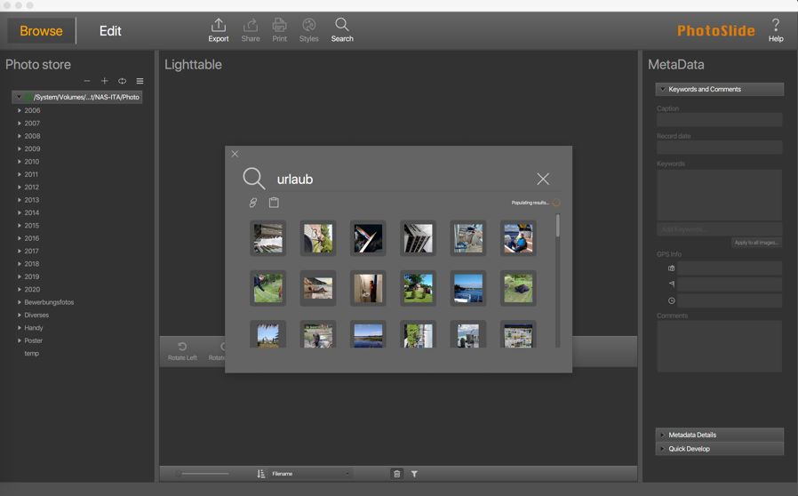
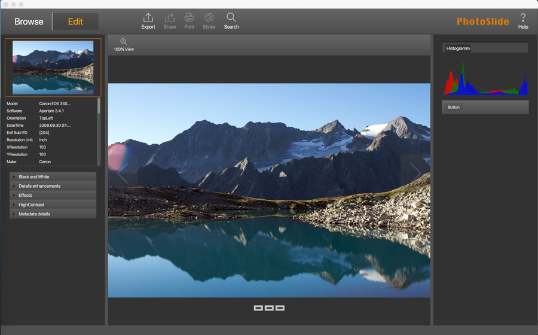

This application uses concepts from Lightzone and Lightroom and represents a simple Photo management application with 
a modern and reactive user interface written in JavaFX. It is a picture / video viewer with a few editing capabilities 
and metadata support.

Full text search feature

Editor feature

## Features
- Viewing of JPG/TIFF/PNG/PSD images
- Viewing of RAW files for Canon/Nikon/Fuji/Leica/Sigma/Adobe DNG
- Viewing of movies with MP4/h264 codec
- Lossless editing: Rotated / Crop images / rate images
- Add keywords and tags to images
- Read all metadata (IPTC, XMP, ...) from the image
- Write metadata
- Apply mass updates to metadata on images
- Export images including changes to JPG/TIFF/PNG
- Drag and drop media files to desktop (multi selection on OSX not possible)
- Copy/Paste images from one directory/collection to another
- Have as many places to store photos/videos as you want
- Usage of multi threads for reading image information / editing and metadata support
- Nicer icons with (ikonli)
- Cut/copy/paste in the collections module so that you can have your actully working collection locally and the rest on the NAS
- Stacking of photos
- Full text search using an H2 database (will be created automatically in the background)
- Implemented multithreading for media loading (depends on the operating system - try to create threads as much as possible from the OS)
- First implementation of an edit view (actually only an exposure filter is added)
- Support for GPS information in meta data of image files
- Printing support inclusive borderless printing (experimental)
- Bookmark files independent where found
- Export/clipboard bookmarked files
- Software update: Check for new version of photoslide and download/install it if user wants it
- View of GPS position information on an OSM map