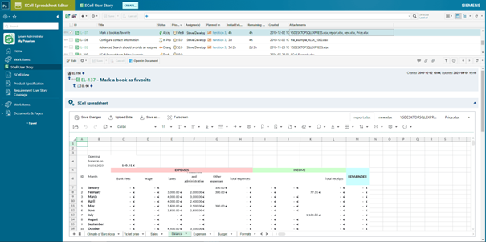
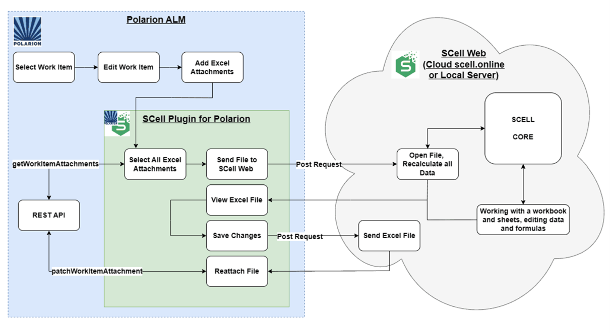
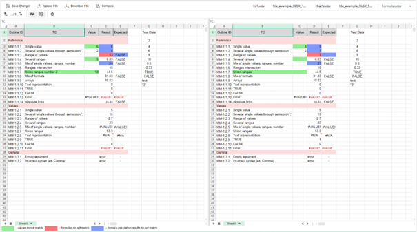

In this article, we present the integration of our innovative Java-based spreadsheet solution SCell into the browser-based Application Lifecycle Management system Polarion ALM, enabled by JPro from Sandec GmbH.

We demonstrate how companies can seamlessly embed full spreadsheet functionality into a web-based environment, providing users with a consistent and efficient workflow.

**Background and Challenges**

[Polarion ALM](https://plm.sw.siemens.com/de-DE/polarion/application-lifecycle-management-alm) by Siemens is a well-established platform for managing the entire requirements, testing, and release lifecycle in software and system development projects. [SCell](https://www.jfx-central.com/libraries/scell) was designed to extend applications with powerful spreadsheet functionality to avoid unnecessary, manual intermediate steps and media disruptions, without requiring additional development effort.

However, SCell was initially developed exclusively for JavaFX and Java Swing desktop environments.

Our prospective customers were therefore faced with two challenges:
1.	**Current limitation to Desktop:** Users such as those for Polarion ALM, who work exclusively in web-based environments, could not use the SCell integration.
2.	**Consistent User Experience:** Tasks such as loading and editing spreadsheet data, always require switching between desktop and web clients, which is inefficient and disrupts the workflow. Not to mention the decentralized storage of data and the transfer e.g. of calculation results.

**Solution Concept**

To quickly overcome these limitations, we used **JPro** in collaboration with Sandec.  [JPro](https://www.jfx-central.com/tools/jpro) renders JavaFX applications in the browser without Java having to be installed on the client. This means that SCell can also be used seamlessly in a web environment such as Polarion.

**Architecture Overview**

*	**Polarion ALM** serves as a container and platform for the specific management process.
*	**SCell** is a Java-based component (library) for processing XLSX files.
*	**JPro-Server** delivers the rendered JavaFX interface of SCell in the browser.
*	**SCell plugin** for Polarion opens and embeds the JPro-based spreadsheet of SCell.

**Technical Implementation**

**Installation and Configuration**

1.	**JPro with SCell-Integration**
	-	Installation of the JPRO server on an application server (Linux and Windows).
	-	Provision of the SCell libraries integrated as a WAR package.
	-	Configuration of the reverse proxy to forward browser requests to JPro
2.	**SCell-Plugin for Polarion**
	-	Installation of the SCell Spreadsheet Editor PlugIn: [https://scalable-components.com/scell-spreadsheet-editor/#download](https://scalable-components.com/scell-spreadsheet-editor/#download)
	-	Storage of the JPro URL in the plugin settings

**Workflow in the Browser**

*	Users can open an existing work item in Polarion.
*	A new SCell spreadsheet is loaded in an inline frame via the Plugin.
*	Spreadsheets can be edited, formatted and calculated directly in the browser, just like in a desktop application.

**Custom Feature Development**

Within the scope of a specific customer project at an international manufacturer, SCell was adopted as a general solution and extended with a special feature:

*	**Side-by-Side Comparator function** enables engineers to directly compare two XLSX files on the screen, whether they belong to different work item attachments or to the revision of the same xlsx attachment.
*	**Results:** The engine not only allows easy and fast identification of differences in **data, formulas, and calculation results,** but also significantly reduces the risk of errors, ensuring data integrity and enhancing decision-making across projects.

These customer-specific enhancement demonstrates how flexibly SCell can be adapted beyond standard use cases. At the same time, all future users **benefit** from the core engine and can integrate similarly tailored features into their own ALM environments.

**Demo – Video**

A live demo of the integration is available on our YouTube channel (1:39 minutes):

[SCell in Polarion ALM mit JPro – YouTube](https://www.youtube.com/watch?v=BRatqb2RwIw)

**Advantages and Benefits**

*	**Centralized solution:** No context switching between desktop and web. 
*	**Data security:** XLSX files are saved audit-proofed and secure in Polarion.
*	**Platform-independent:** Browser-based use without Java client.
*	**Easy maintenance:** Updates for JPro and SCell are immediately visible via Plugin.

**Outlook and further Information**

*	**Technical Documentation SCell:** [https://scomponents.github.io/scell-public-docs/index.html](https://scomponents.github.io/scell-public-docs/index.html)
*	**Polarion-Integration:** [https://scalable-components.com/polarion-alm-excel](https://scalable-components.com/polarion-alm-excel)
*	**JPro product page:** [https://www.jpro.one](https://www.jpro.one)

We look forward to your feedback and are happy to answer any questions you may have. Let's work more efficiently together - with SCell and JPro in web applications like Polarion ALM!