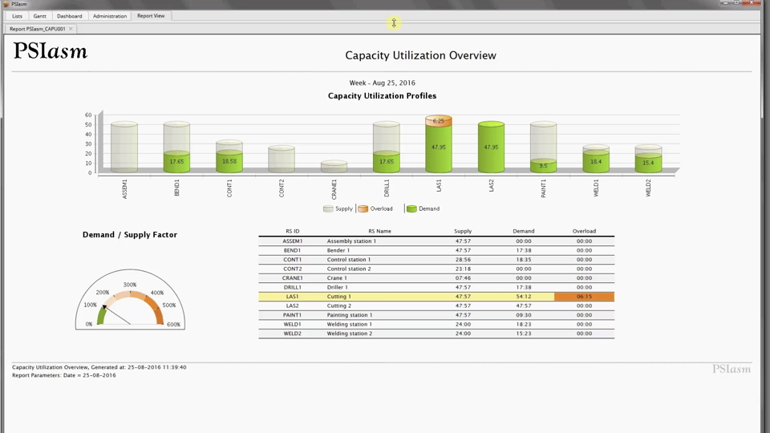
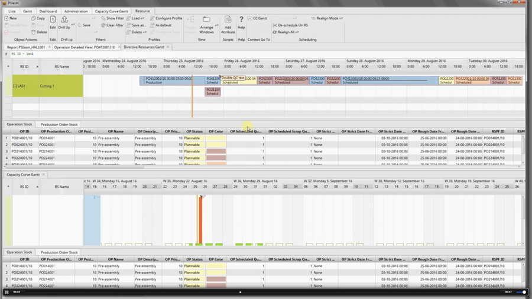
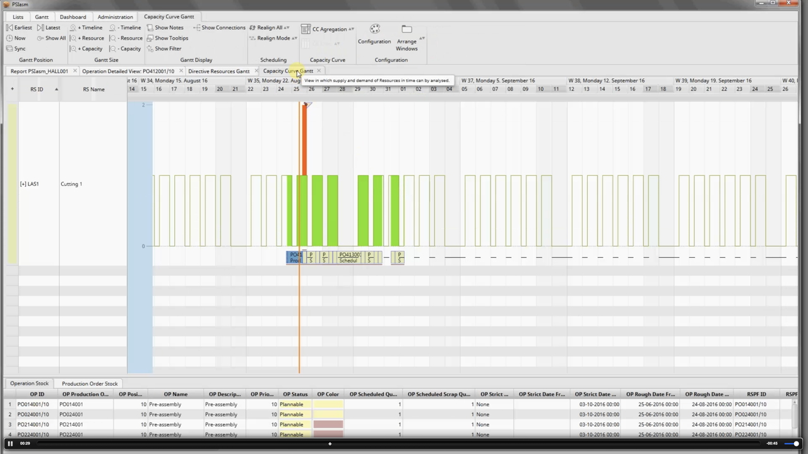
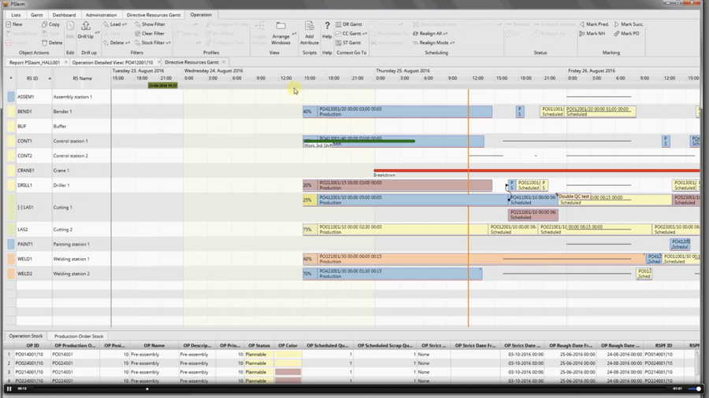
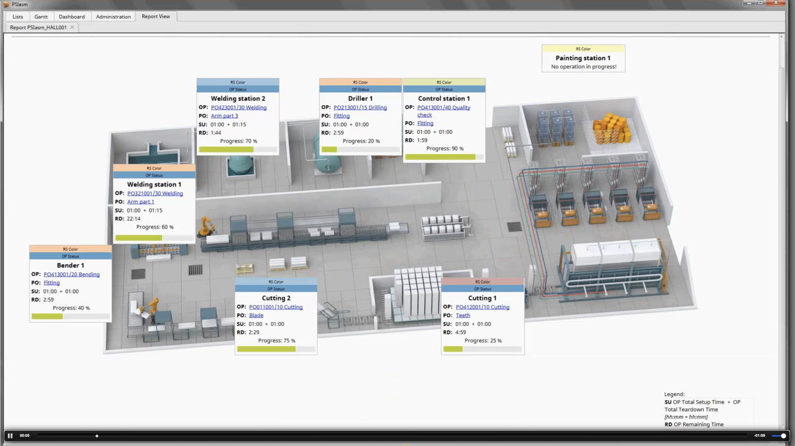

PSI ASM is used in manufacturing to schedule and monitor manufacturing processes. It allows its user 
to quickly gather an inside look into the current activities of a manufacturing site.

Features:

- Develop your production schedules in just seconds, based on the technologies in place, available resources, and current production
- Avoid long hours of Excel-based scheduling
- Involve your planners in the scheduling process in real time
- Enhance customer service and internal communication with automatic updates on feasible lead times and current order status
- Automatically identify weak points and glitches in your schedule which undermine production efficiency
- Analyse your production process stage by stage based on clear and simple data visualisation tools

