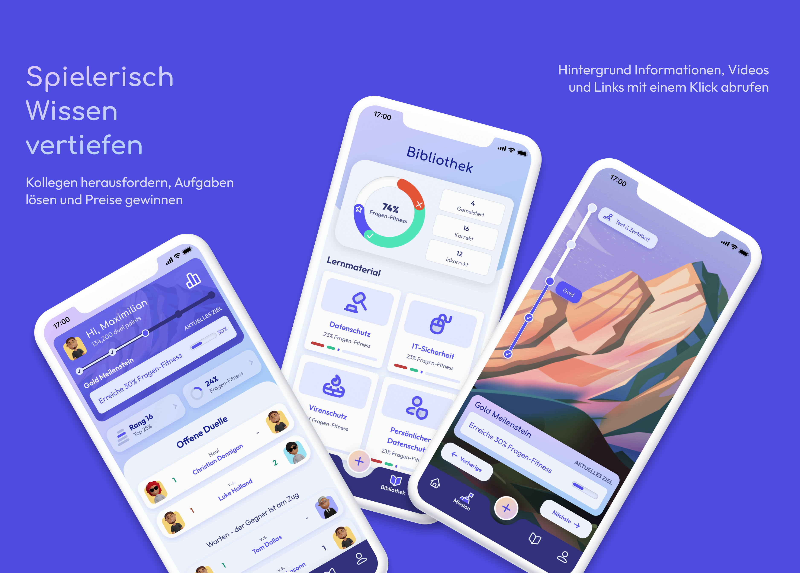
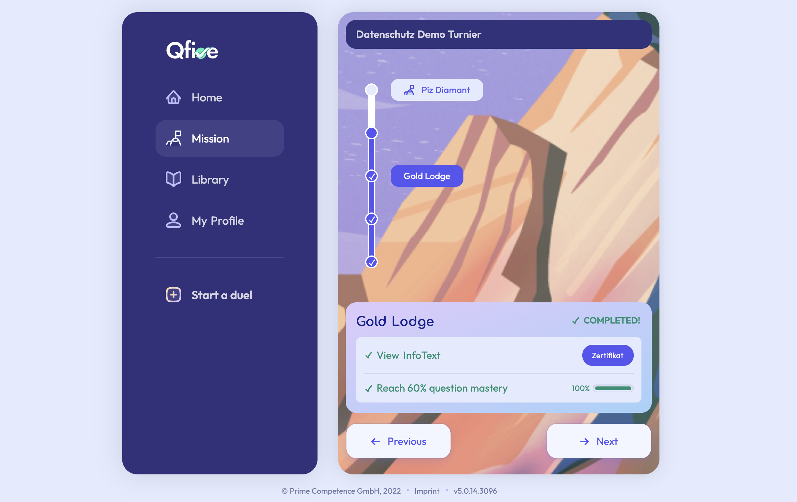

[QFive](https://q-five.com/) is a true cross platform e-learning application. 

With QFive companies can carry through eLearning campaigns for their employees, combined with entertaining elements of gamification.

It runs on desktops, in all common web browsers on mobile and on desktops (with [JPro](https://www.jpro.one/)) and as native mobile app on iOS and Android.  All the same source code.  The application was developed by the SANDEC team in cooperation with the company Prime Competence from Zürich.

