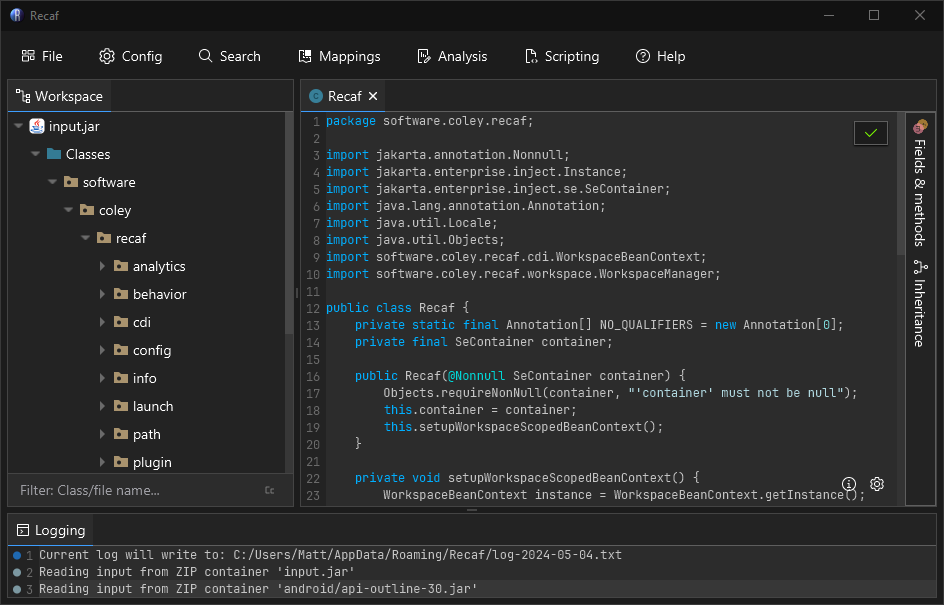
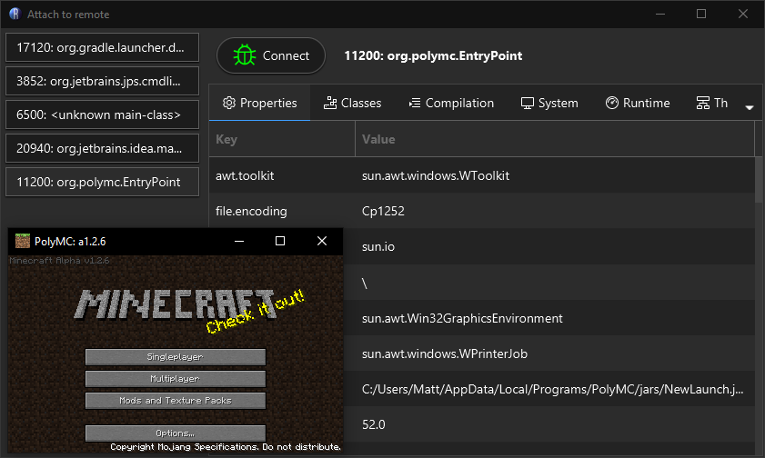
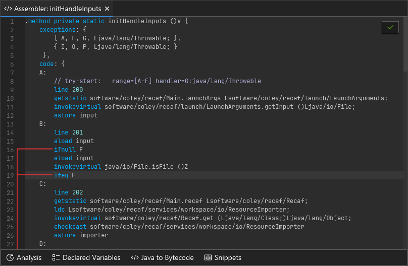

Recaf is an open-source Java bytecode editor that simplifies the process of editing compiled Java applications. To make things easier Recaf abstracts away much of the class file format. Difficult tasks such as updating stack-frames are done automatically. Along with additional features to assist in the process of editing classes, Recaf is the most feature-rich bytecode editor available.

