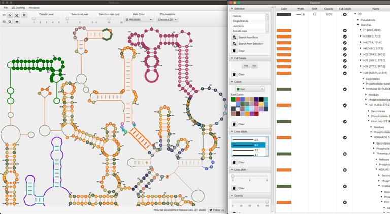
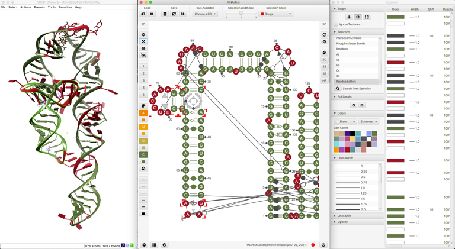
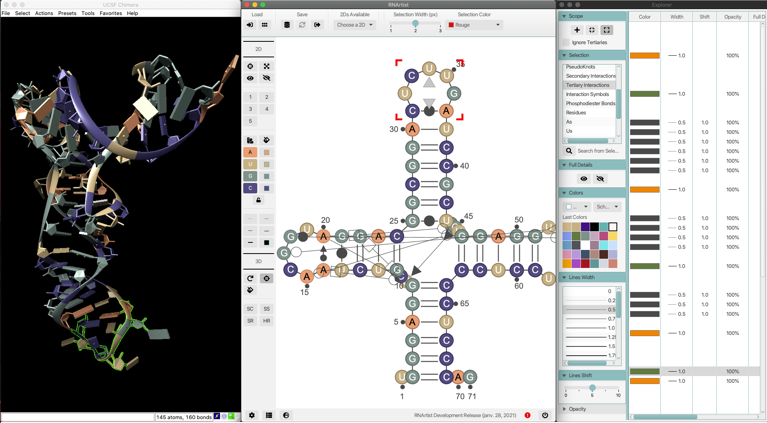
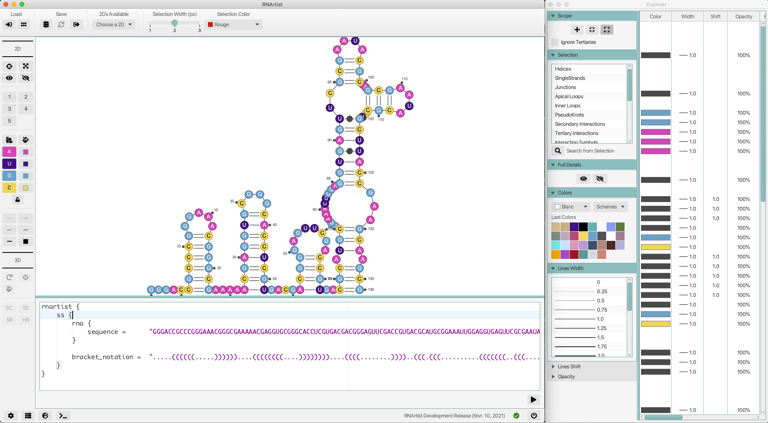
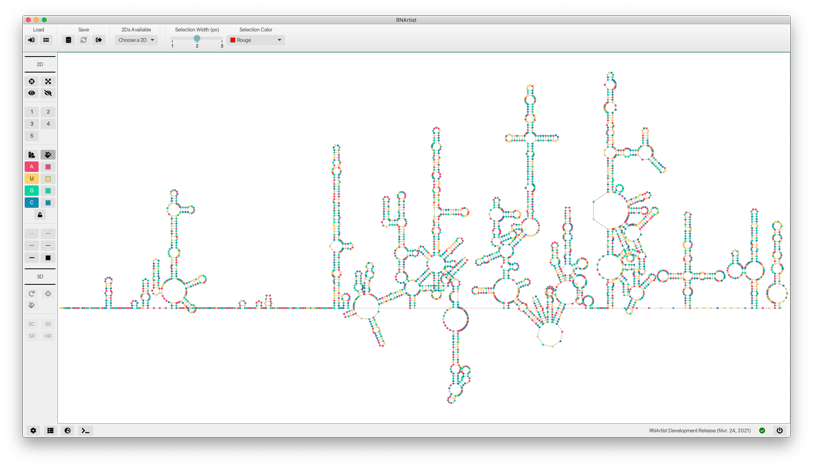

RNArtist allows you to design your RNA 2D structures interactively. To help you to be an RNArtist, 
this tool provides numerous graphical options to find your theme and to modify the 2D layout.

