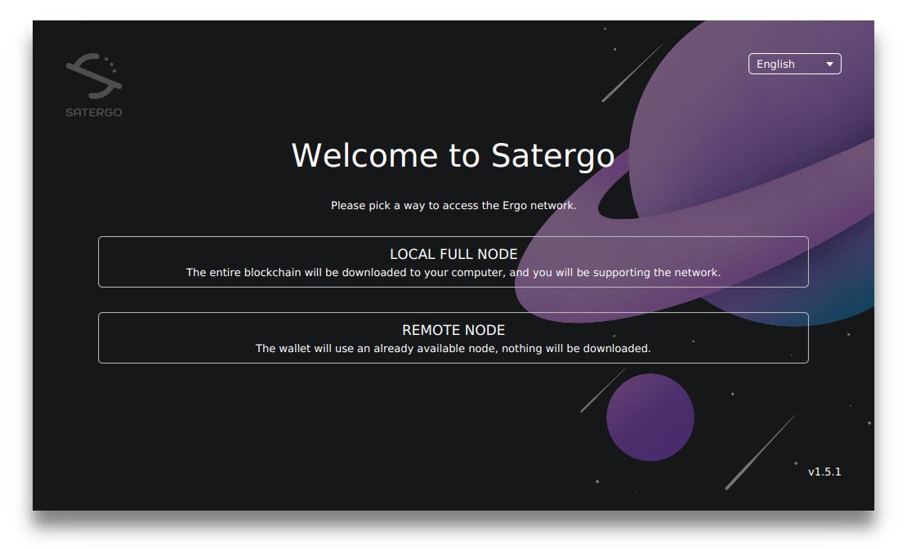
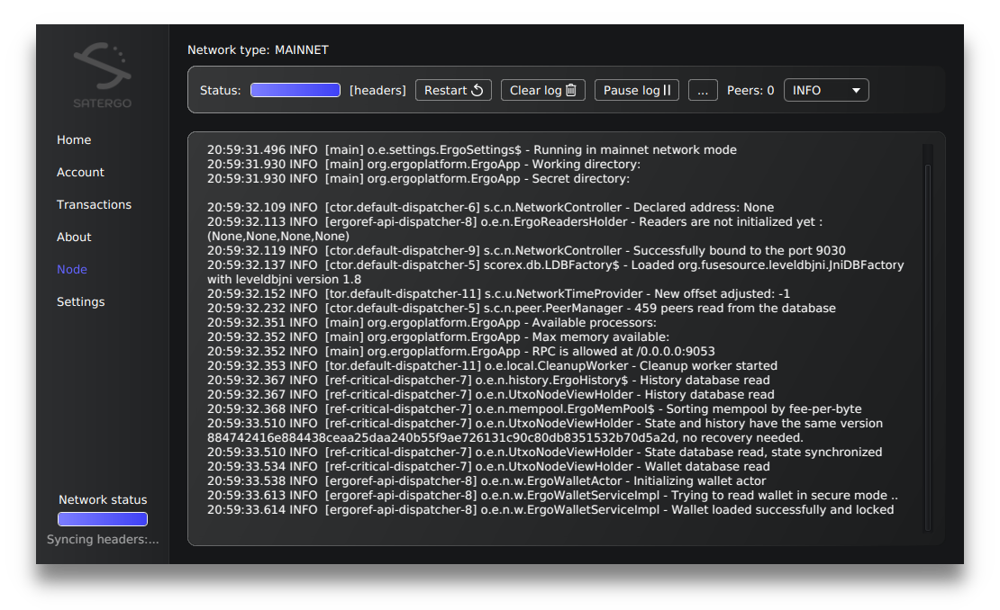
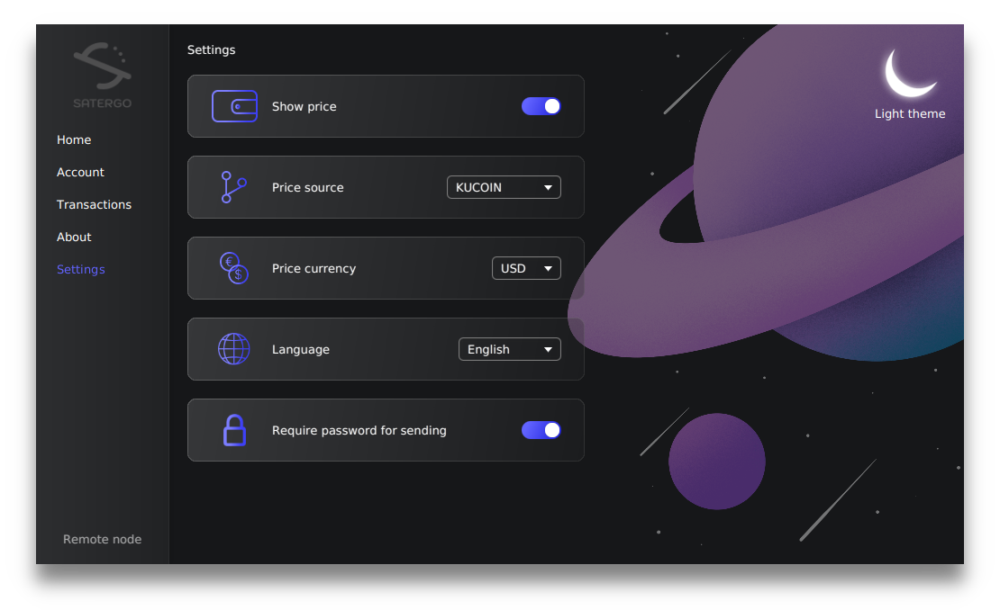

[Satergo](https://satergo.com) is the desktop wallet for the cryptocurrency Ergo.

It allows users to access, manage and spend their funds on the Ergo blockchain without having to rely on external software.
To help strengthen the Ergo network, it lets users set up a full blockchain node with a few clicks and then assists them in maintaining it.

The application is based on the latest Java and JavaFX versions and uses a completely custom stylesheet to make the user interface pleasant.
The style includes among other things a complete revamp of dialog windows to match the application style and look like a natural part of it.

