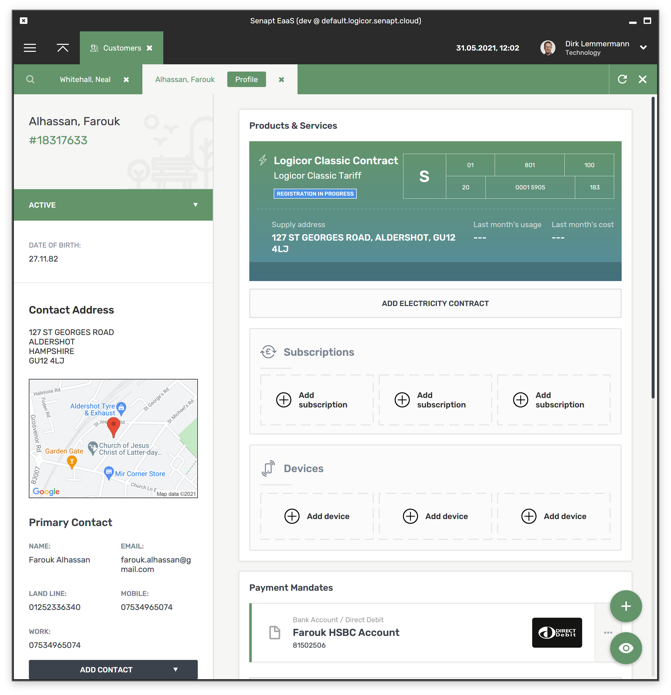
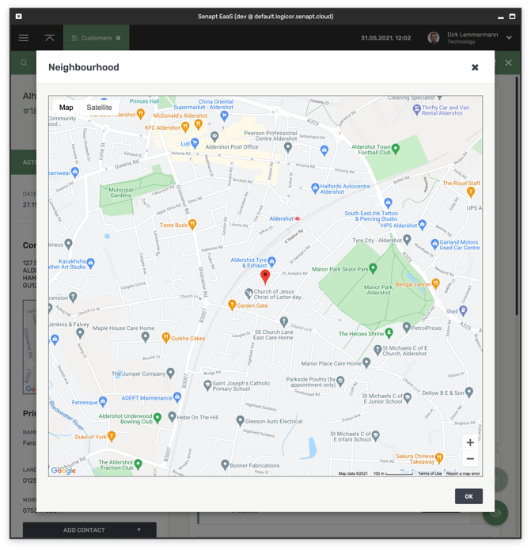
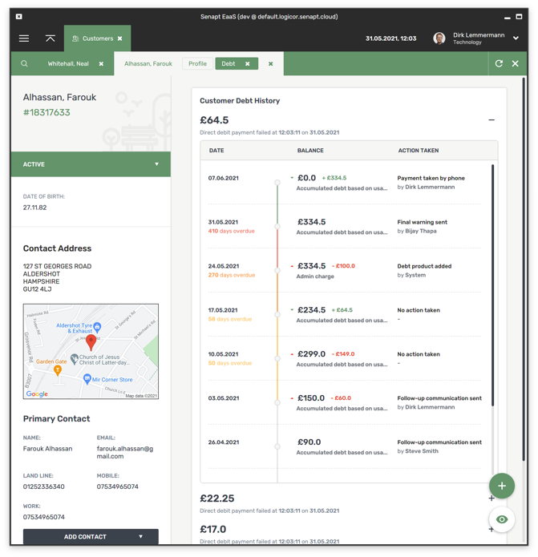
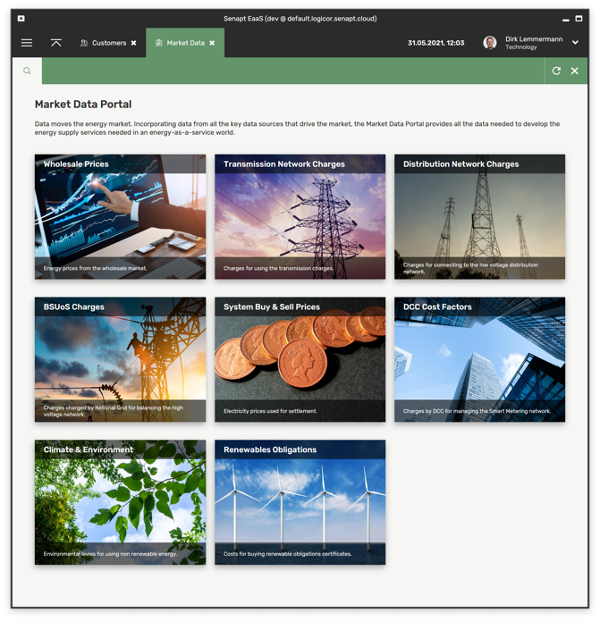
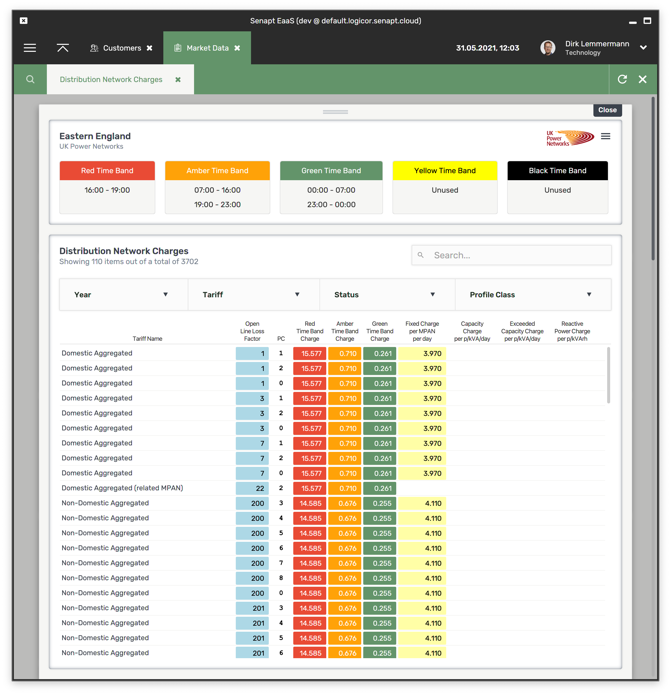

Senapt EaaS is a desktop software (that can also run in a browser) to manage the day to day operations
of an energy supplier. The application allows the user to add new customers, to edit customer contact
and contract information, to create products (tariffs), to send out invoices, to collect payments, etc...

