SmartFinder is a Desktop Search tool that allows you to use an innovative way to search for your Desktop files with an experience similar to Web search!

With SmartFinder you have everything just a click away and in a single view!
From the ability to open the first relevant files already while typing the words to be searched, to links with **meta-data** to directly filter the results, to viewing an exceprts of the document with the searched words highlighted!

What if you need to know which files have the same content? Yes, with SmartFinder you can do this and much more, read all the features we have developed to make you always find what you are looking for and more.

For further information [visit our site](https://serendigity.it/products/smartfinder/).

Feel free to [contact us](https://serendigity.it/#contatti).
## Download Link

SmartFinder is available for **Windows** and **Mac** operating systems.

| Platform | Link|
|----------| ---------------------|
| Windows  | [Microsoft Store download link](https://www.microsoft.com/store/apps/9PD0BCV3WKD1) |
| MacOS    | [Apple MacOS APP Store download link](https://apps.apple.com/us/app/smartfinder/id1624772158) |

## SmartFinder in action
[SmartFinder Youtube playlist](https://www.youtube.com/playlist?list=PLG6jFnBRDFm8aOs9EZrsJ_490X1nWvsH2)

[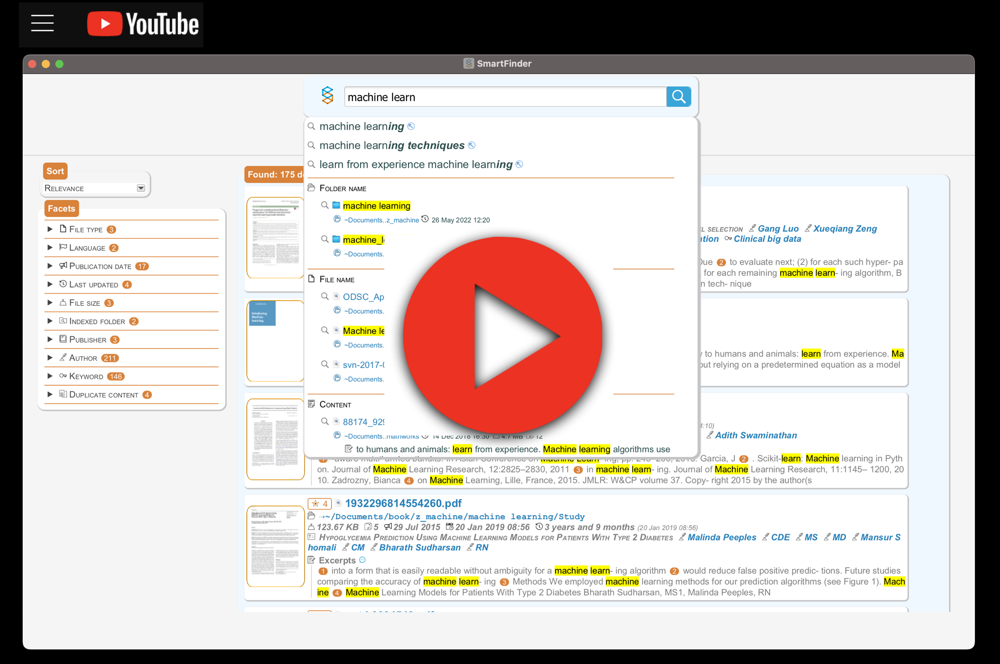](https://www.youtube.com/playlist?list=PLG6jFnBRDFm8aOs9EZrsJ_490X1nWvsH2)

## Feature

* Find **any combination** of words to search: the words entered are searched regardless of the character type (upper or lower case) and their order;
* **Suggestion** of the words to search for: while typing the word to search for, the completion of the word entered and further words relevant to the context are suggested;
* **Instant search**: while typing the words to search for, the first relevant files are presented;
* **Metadata**: the search results show all the most significant metadata of the document (title, authors, publisher, keywords, ..);
* **Highlight**: the search results show an extract of the text for each document with the searched words highlighted;
* **Links** in the search results: for each file found there are links to automatically open the found file, open the folder it belongs to and filter the results for some meta-data;
* Search results **statistics**: for each search, the statistics of the files found based on the most significant meta-data will be displayed;
* **Refine your search**: you can refine your search with the metadata of the document (author, publisher, keyword, ...) or through the category to which it belongs (video, audio, ebook, ...);
* **Sort** the results: you can sort the results by relevance, size, last update date;
* Search with **special characters**: you can use special characters to find sets of words or to exclude words;
* **Duplicate** files: Instantly detect if there are duplicate files (same content). All duplicate files related to the found document are presented in the search results;
* **SmartFinder wherever you want**! You can also use SmartFinder from your browser and **share** the use remotely even with all the devices on your network: read your Desktop files from your mobile phone!;
* Search also on **virtual** **folders**: you can search on all the folders you share on your disk such as **Dropbox**, **OneDrive** or **ICloud**!

## Some screenshots

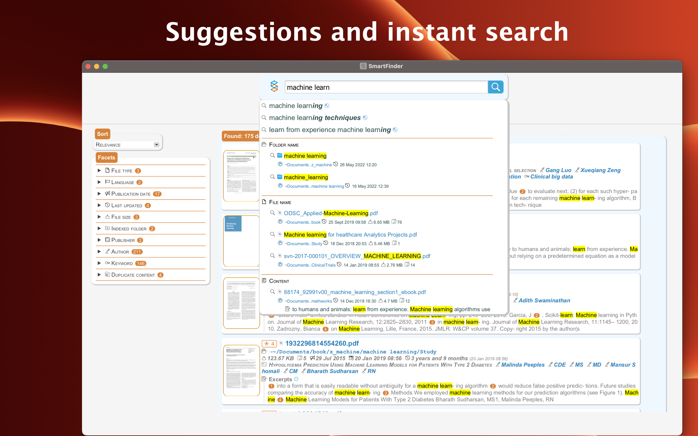
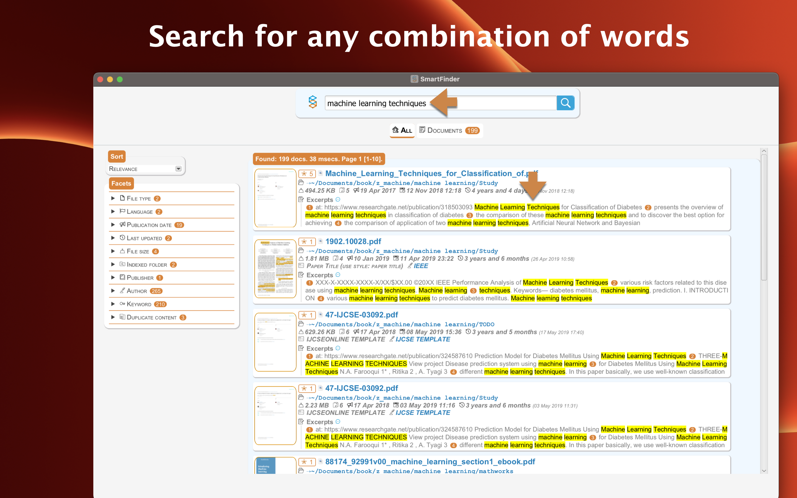
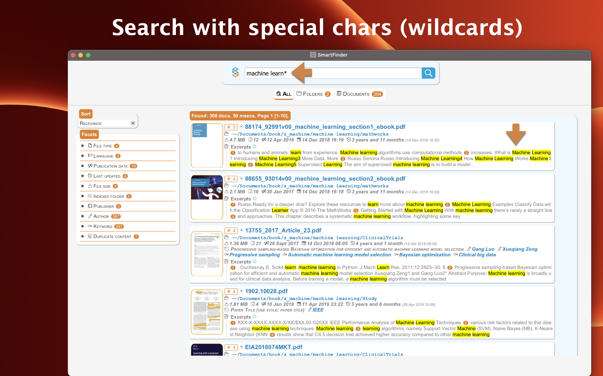
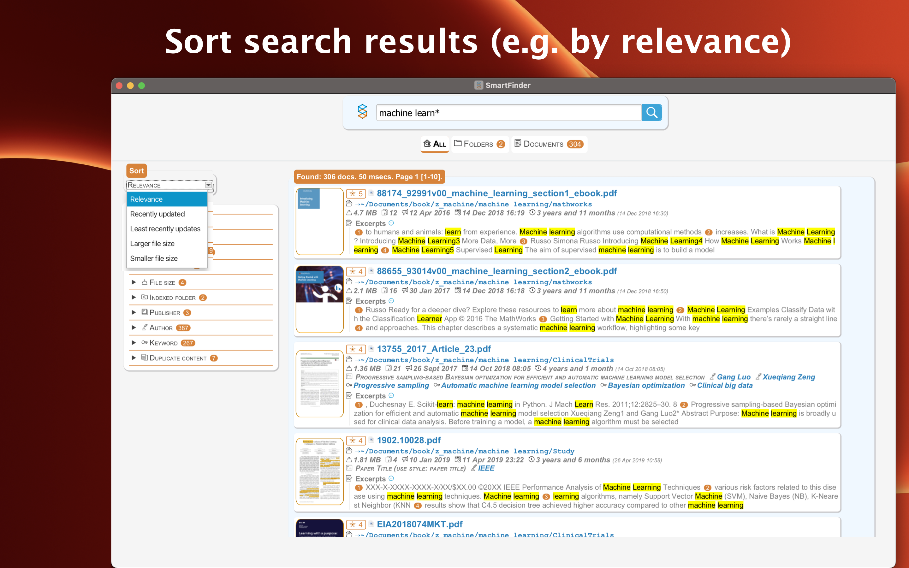
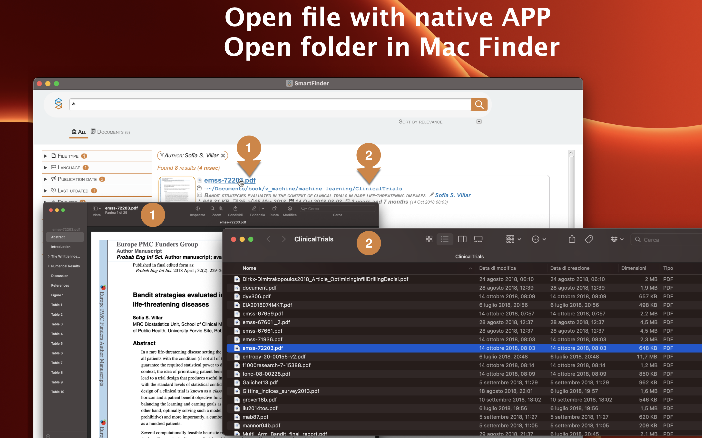
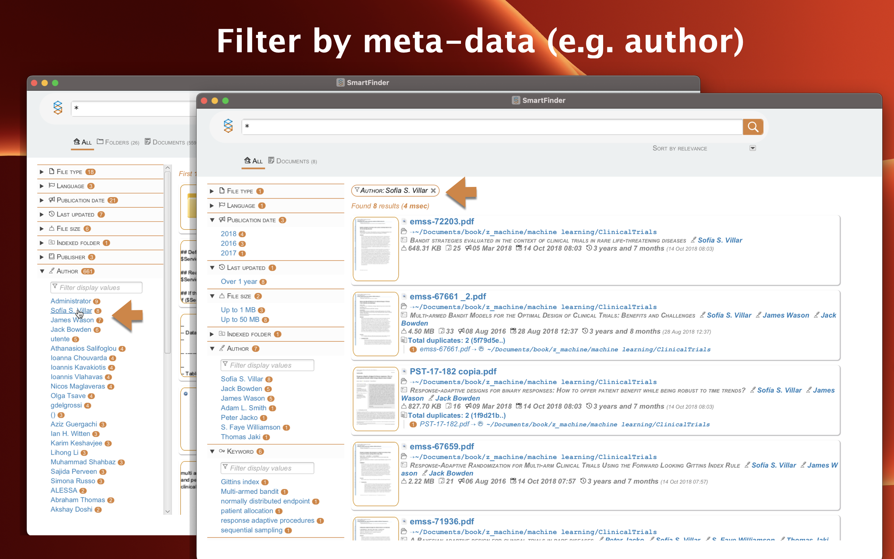
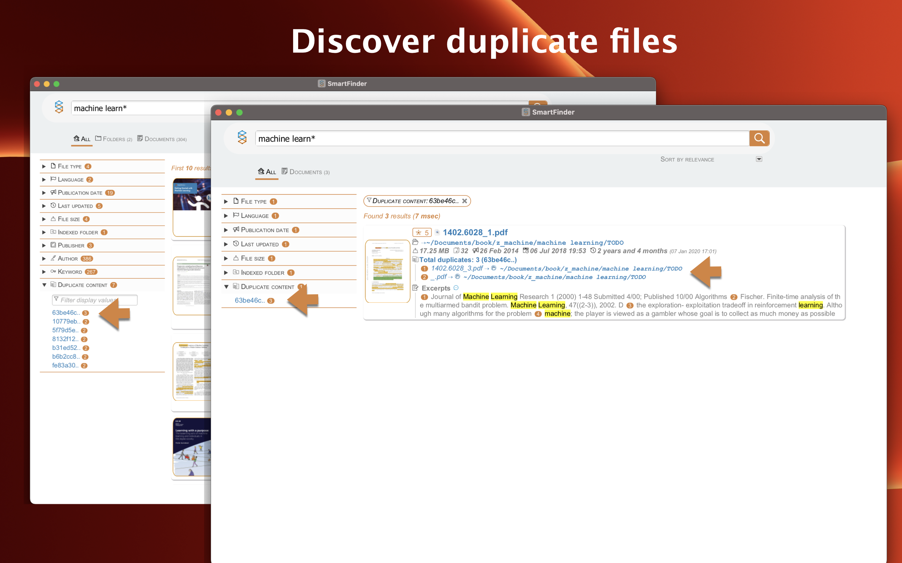
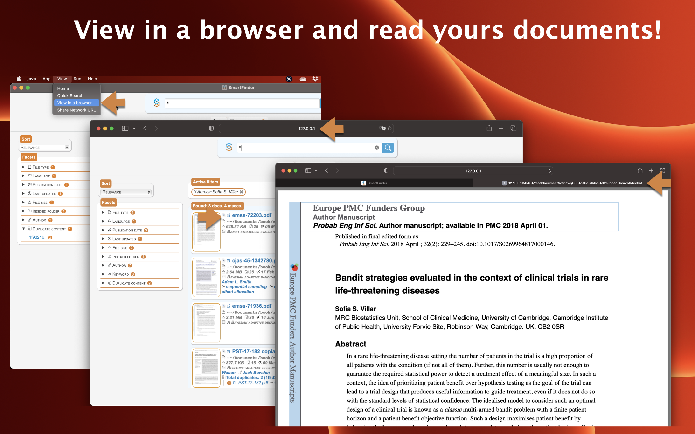
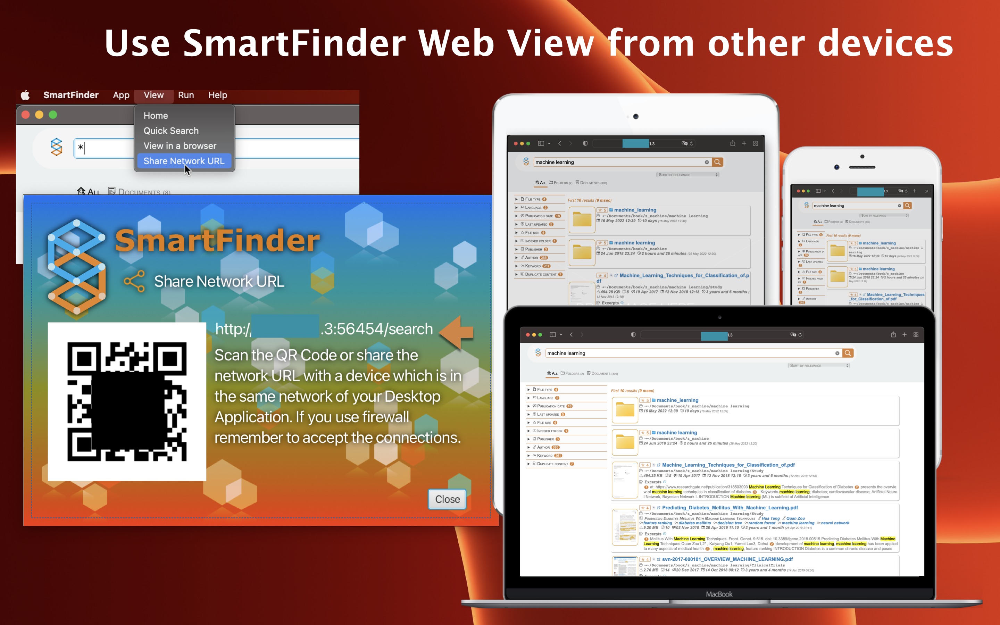
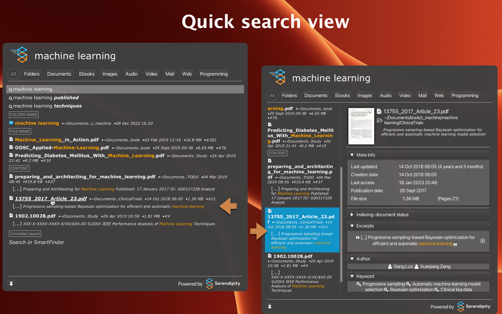

## License

Commercial License

## Some open source libraries used
* JavaFX
* Apache Lucene
* Apache Tika