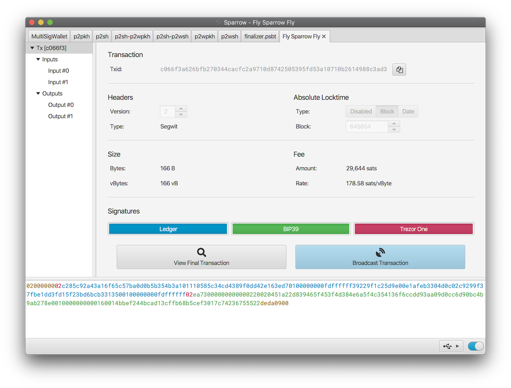
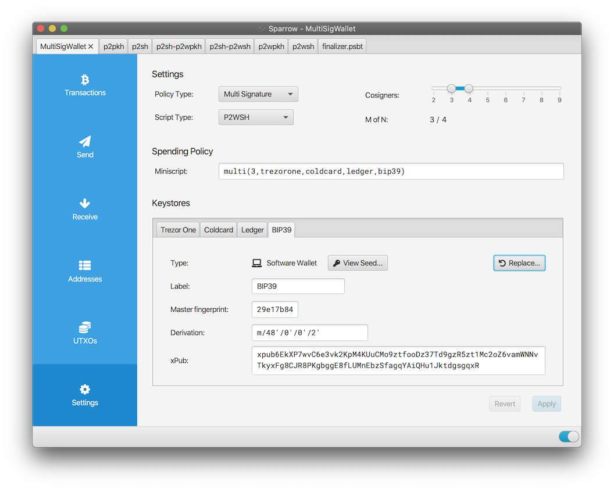
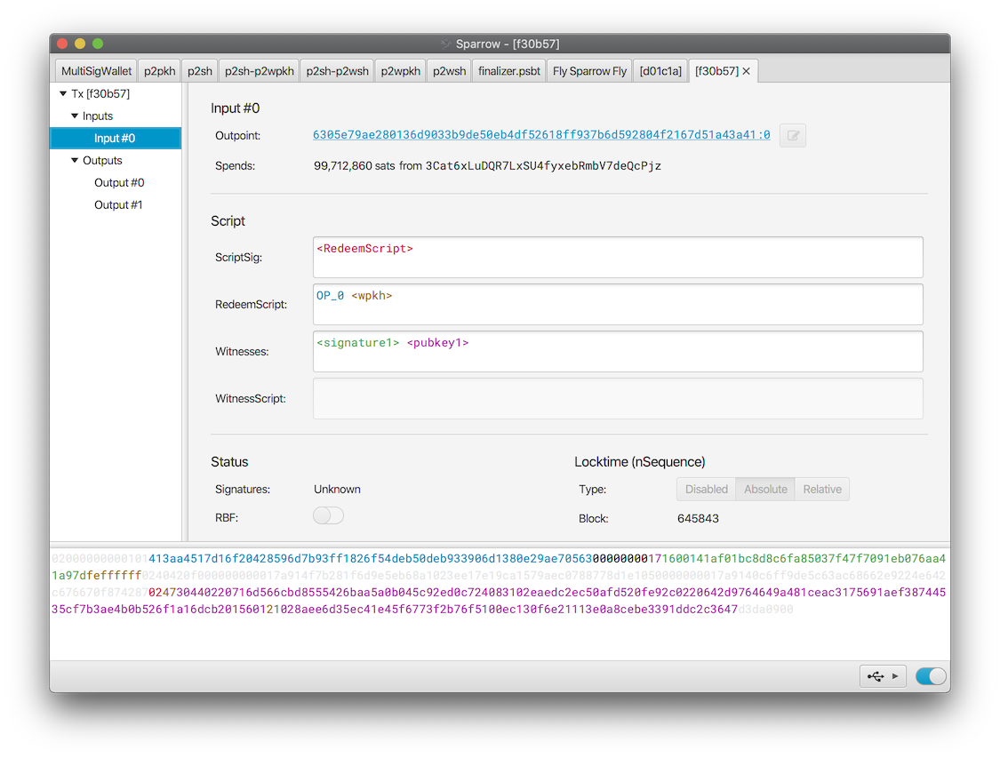
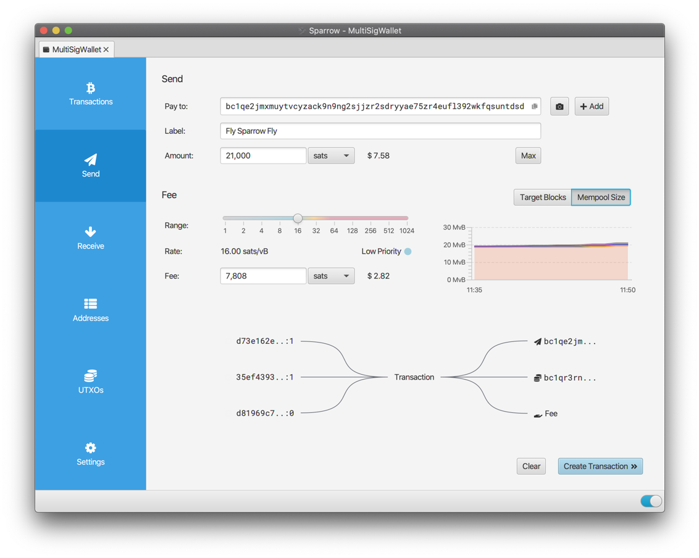
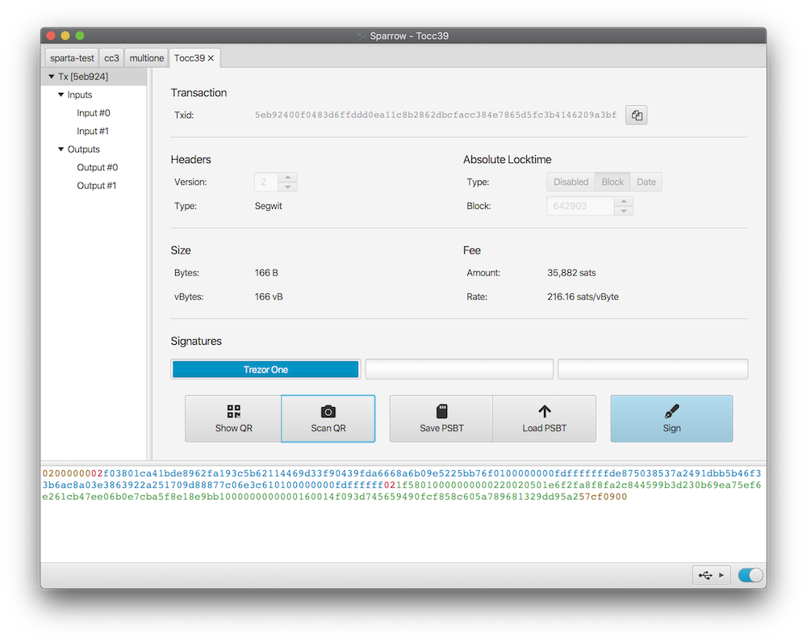

Sparrow is a Bitcoin wallet for those who value financial self sovereignty. Sparrow’s emphasis is on security, privacy and usability. Sparrow does not hide information from you - on the contrary it attempts to provide as much detail as possible about your transactions and UTXOs, but in a way that is manageable and usable.

Sparrow supports all the features you would expect from a modern Bitcoin wallet:

* Full support for single sig and multisig wallets on common script types
* A range of connection options: Public servers, Bitcoin Core and private Electrum servers
* Standards based including full PSBT support
* Support for all common hardware wallets in USB and airgapped modes
* Full coin and fee control with comprehensive coin selection
* Labeling of all transactions, inputs and outputs
* Lightweight and multi platform
* Send and receive to PayNyms, both directly (BIP47) and collaboratively
* Built in Tor
* Testnet, regtest and signet support

However, Sparrow is also unique in that it contains a fully featured transaction editor that also functions as a blockchain explorer. This feature not only allows editing of all of a transaction’s fields, also easy inspection of the transaction bytes before broadcasting. 

Sparrow is also strongly supportive of privacy, and aims to be a wallet that takes users on a privacy journey from using public servers to using cold storage techniques on private servers. 

