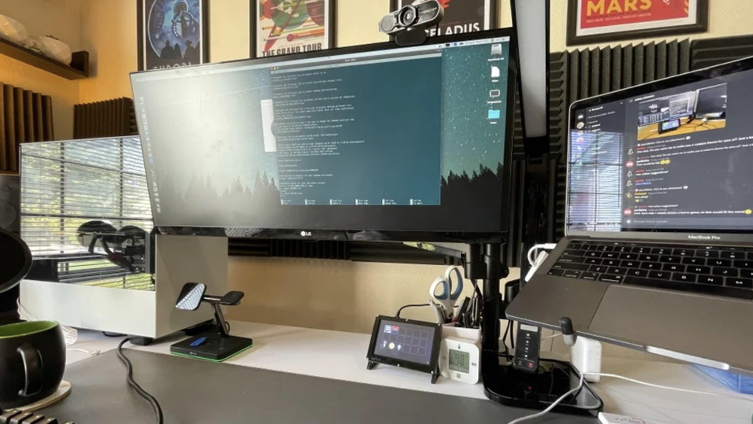
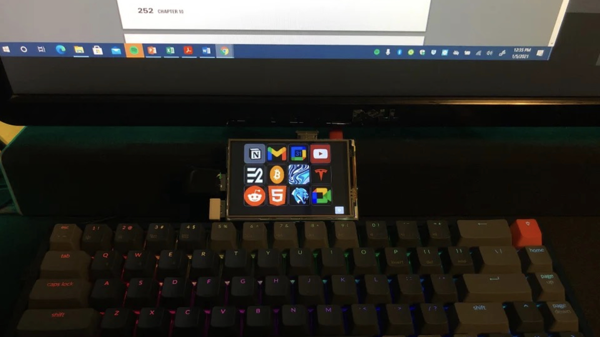
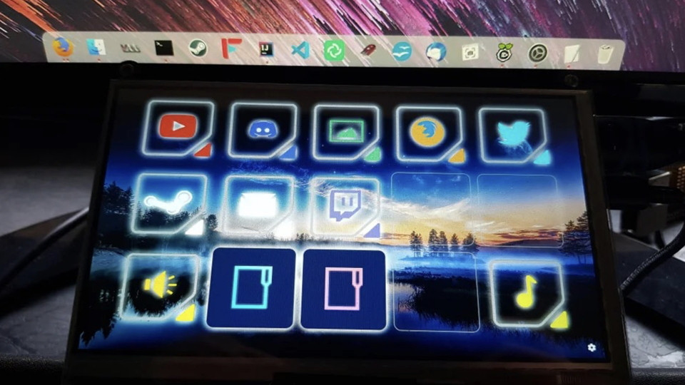
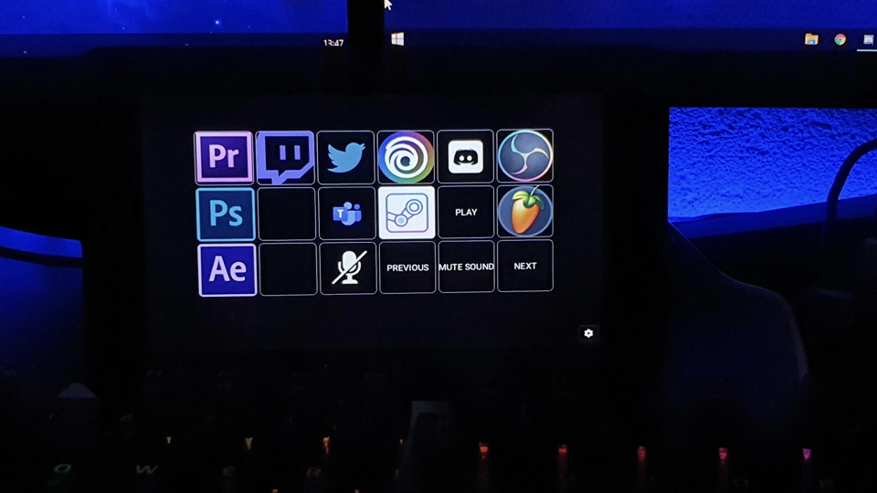
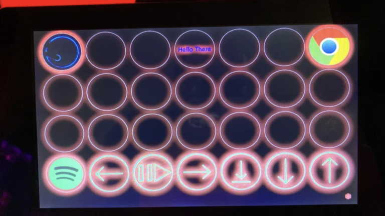

Stream-Pi is a FOSS Cross Platform Macro Pad software. Entirely built using JavaFX. It runs on Android, 
Windows, Linux (x64, arch64 and arm32), MacOS, iOS and iPad OS. It uses Gluon DRM library to leverage 
hardware acceleration on Raspberry Pi/Linux Arm32 devices. Thanks to Gluon Substrate and GraalVM, it also 
successfully runs very smoothly on Android, iOS and iPad OS.

Stream-Pi offers an API which users can use to build their own custom actions, just like the original 
Streamdeck. It also has a rich theme system that users can customise using JavaFX CSS with the help of 
custom themes. (Some examples included in the screenshots). We also have plans to roll out a market place 
for plugins/themes. (like IntelliJ marketplace/firefox add-ons)

