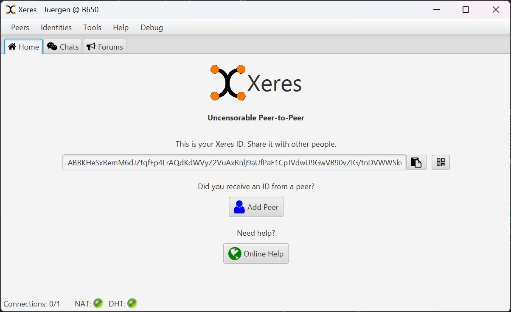
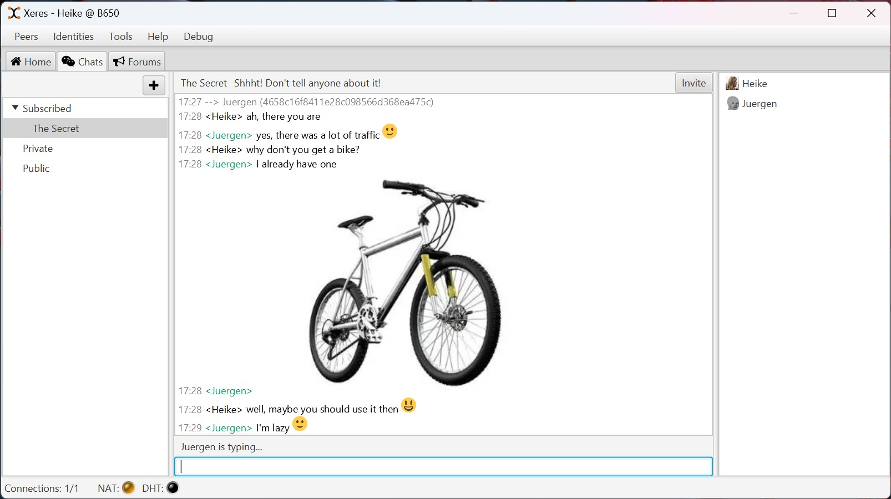
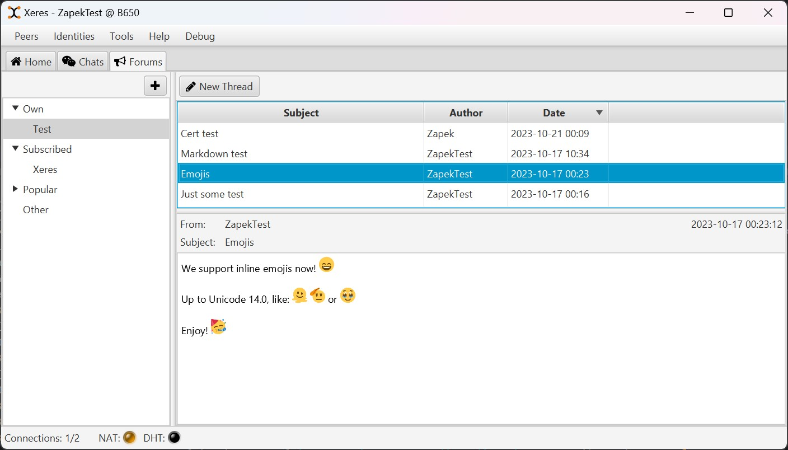

Xeres is a Peer-to-Peer (Friend-to-Friend), decentralized, encrypted and secure application designed for communication and sharing.

It's a Spring Boot app with a REST backend and a modern JavaFX frontend desktop interface.

Features:
- Peer-to-Peer (Friend-to-Friend), fully decentralized
- No censorship. Cannot be censored
- Compatible with Retroshare 0.6.6 or higher
- Hardware accelerated encryption
- Desktop User Interface
- Remote access
- Asynchronous design
- High concurrency
- Free software (GPL)

