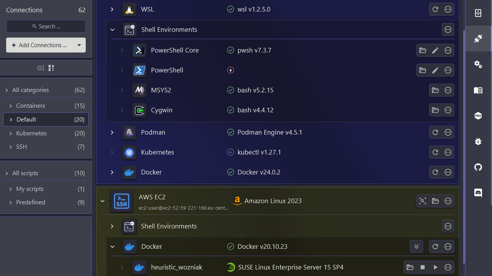
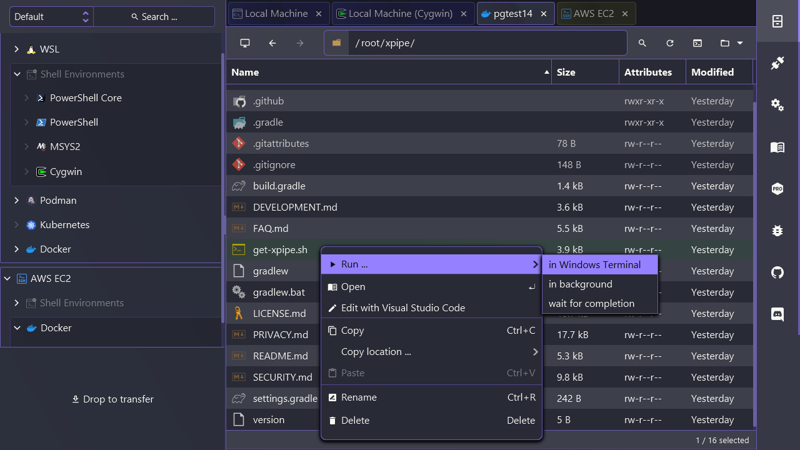
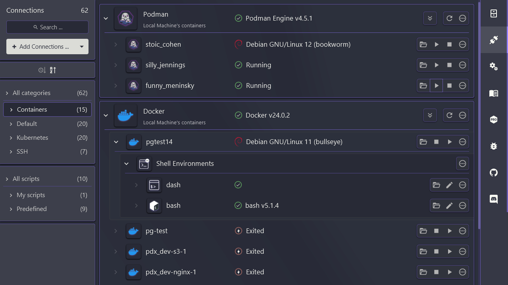

XPipe is a new type of shell connection hub and remote file manager that allows you to access your entire server infrastructure from your local machine.
It works on top of your installed command-line programs and does not require any setup on your remote systems.

XPipe fully integrates with your tools such as your favourite text/code editors, terminals, shells, command-line tools and more.
The platform is designed to be extensible, allowing anyone to add easily implement custom functionality through a modular extension system.

The desktop application is a created with JavaFX and the help of various libraries plus some custom controls.
The general styling is done through [AtlantaFX](https://github.com/mkpaz/atlantafx) in order to achieve a consistent and modern look.
User settings are entirely handled with [PreferencesFX](https://github.com/dlsc-software-consulting-gmbh/PreferencesFX) using a custom skin and layout.
In-app markdown displays for documentation, changelogs, and other dialogs are rendered through the JavaFX [WebView](https://openjfx.io/javadoc/21/javafx.web/javafx/scene/web/WebView.html),
[Flexmark](https://github.com/vsch/flexmark-java), and [GitHub Markdown CSS](https://github.com/sindresorhus/github-markdown-css).

