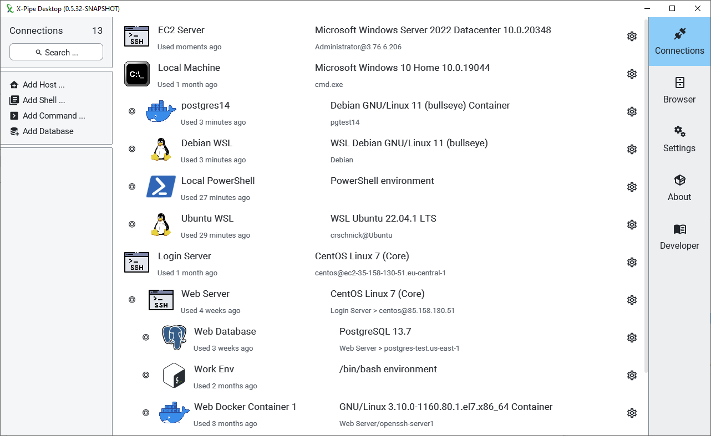
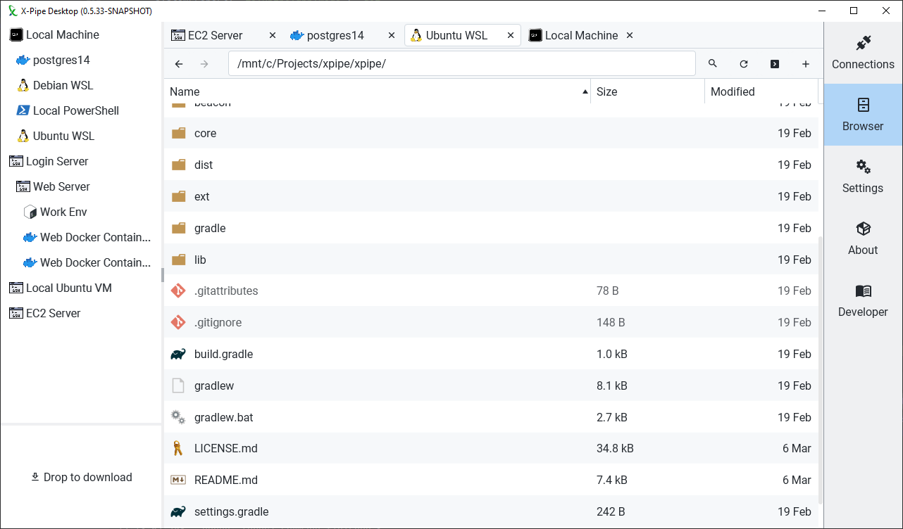
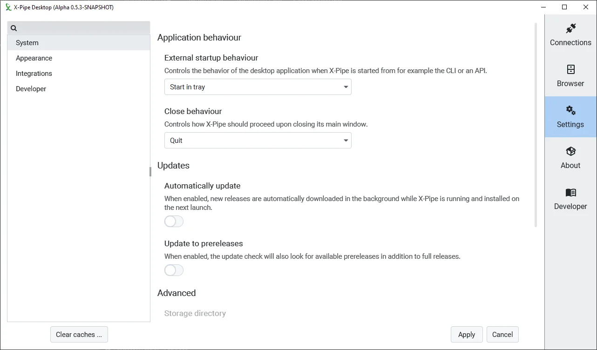
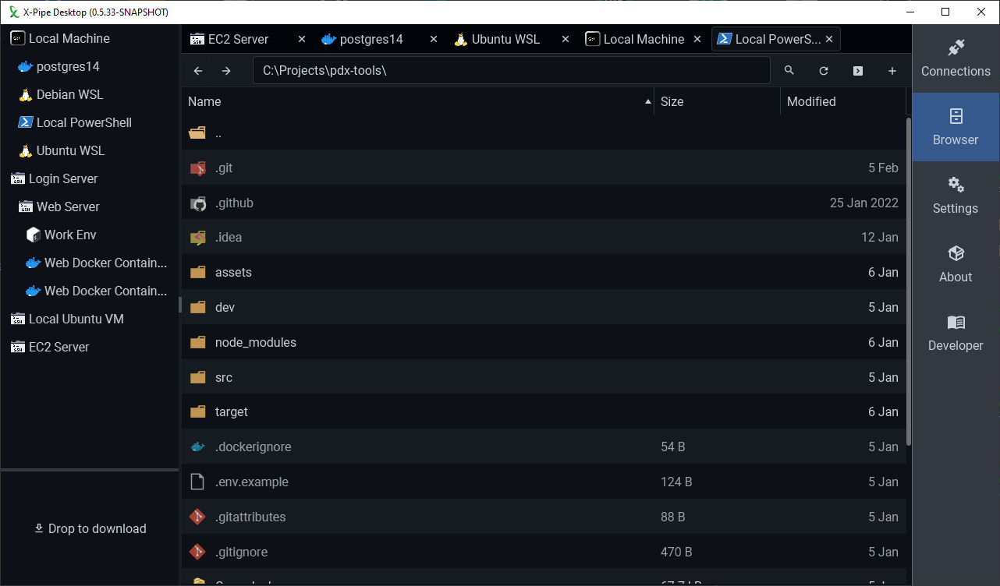

X-Pipe is a connection manager and remote file explorer that works by exclusively interacting with CLI tools on local and remote shell connections.
This approach makes it much more flexible as it doesn't have to deal with file system APIs or remote file handling protocols at all.
As a result, it is easily able to access any remote system, including containers like docker, LXC, WSL, and more.
It integrates with your existing tools and workflows by outsourcing as many tasks as possible to your text/code editors, terminals, shells,
command-line tools and more.

The desktop application is a created through JavaFX, with the help of various libraries in some custom controls.
The general styling is done through [AtlantaFX](https://github.com/mkpaz/atlantafx) in order to achieve a consistent and modern look.
User settings are entirely handled with [PreferencesFX](https://github.com/dlsc-software-consulting-gmbh/PreferencesFX) using a custom skin and layout.
In-app markdown displays for documentation, changelogs, and other dialogs are rendered through the JavaFX [WebView](https://openjfx.io/javadoc/17/javafx.web/javafx/scene/web/WebView.html),
[Flexmark](https://github.com/vsch/flexmark-java), and [GitHub Markdown CSS](https://github.com/sindresorhus/github-markdown-css).

