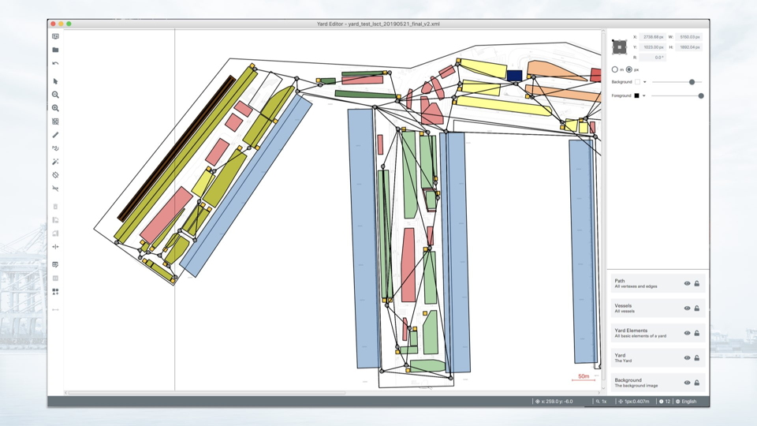
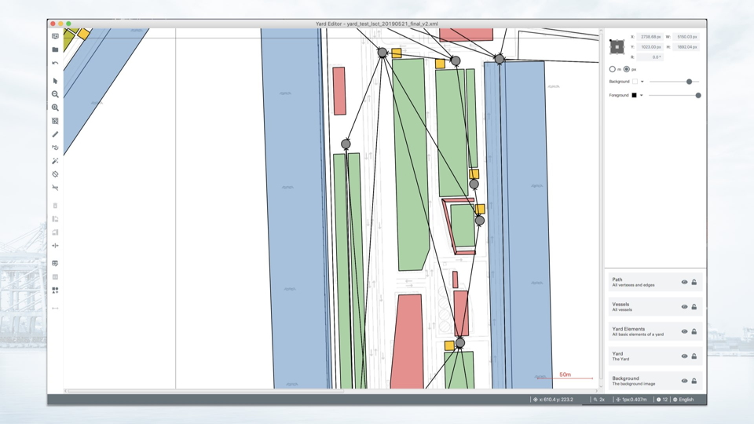
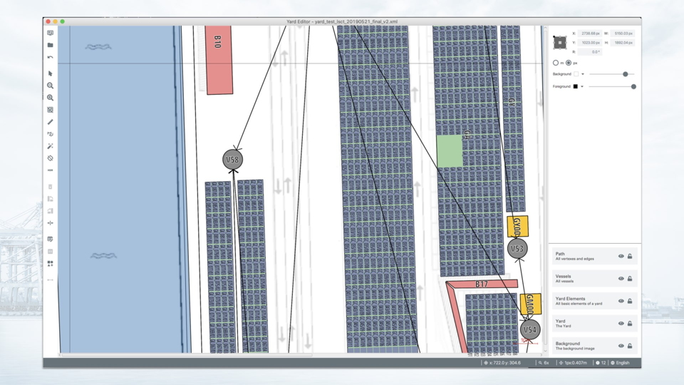

Processing huge amounts of data is always a problem. This was also true for Karakun's customer Contship Italia Group.
The group of companies is the Italian leader in container terminal logistics and intermodal solutions. Their
network of maritime container terminals in La Spezia, Ravenna, Salerno, and Tangier support the global supply
chain to connect the world with Europe and all the Mediterranean countries.

Together with Contship, Karakun developed two editors that simplify and optimize their workflows. While the Vessel
Editor may be used to visualize and manage bays (container block in the transverse direction) of container ships,
the Yard Editor is the ideal tool for visualizing port facilities and for optimizing local processes.

