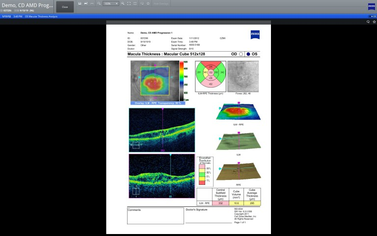
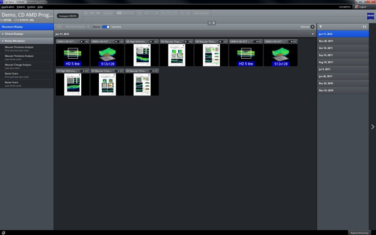
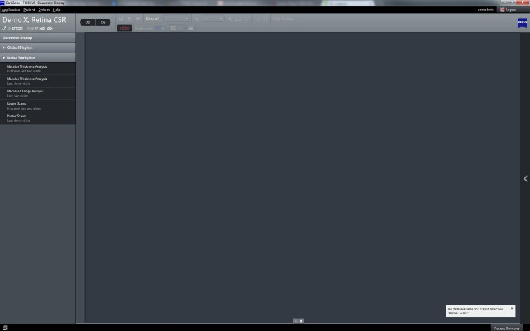
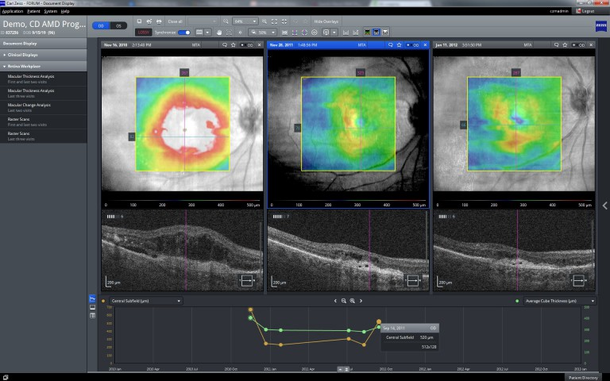
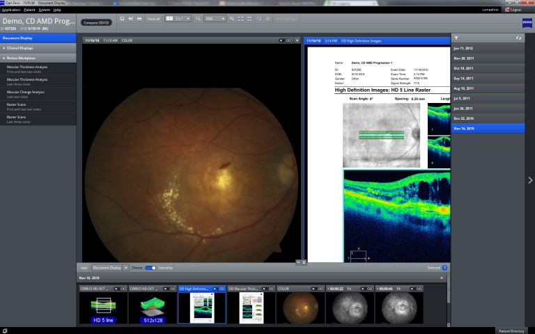
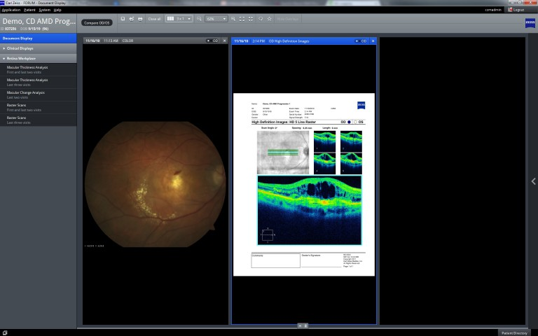

The following client is developed by our (Saxonia Systems AG) customer Carl Zeiss Meditec AG. 
It is an archive software for clinical patient data in ophthalmology. It's a mix of Swing and 
JavaFX and it is still in migration. The possibility to mix both technologies was very important 
for the ability to release new versions until the migration is done. As you can see in the screenshots, 
Swing and JavaFX were mixed multiple times, which results in challenges regarding the synchronization 
of the EDT and the JavaFX thread, focus problems, problems with shortcut handling and look and 
feel differences.

