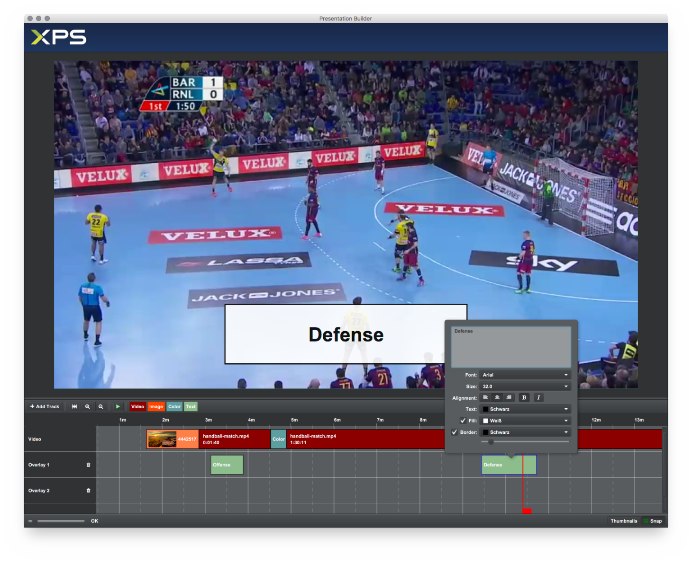
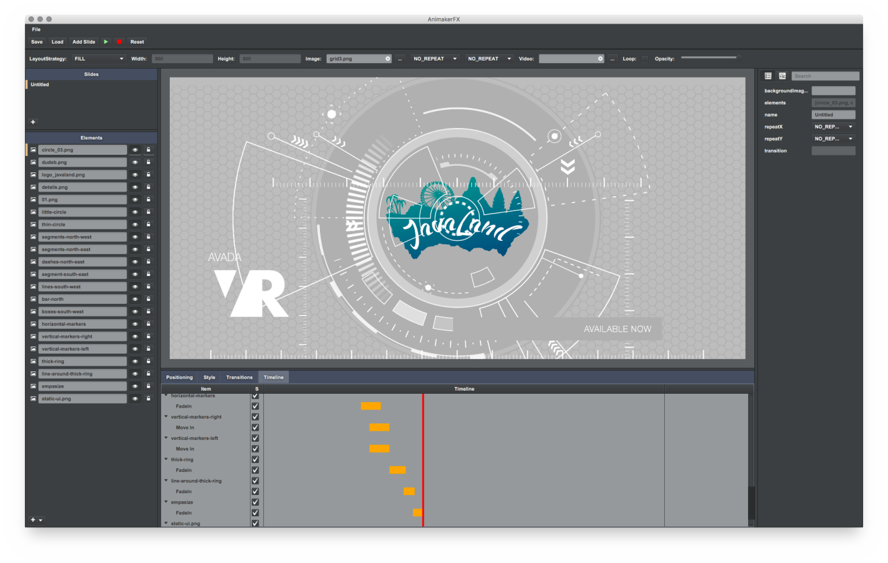

I am a big fan of IntelliJ IDEA and use it every day for the various projects I work on. 
One thing I like a lot is the dark theme called “Darcula”. I like it because it looks cool 
and because of the low contrast it is better for my eyes. When you stare at something for 
at least eight hours a day for decades (yes, I am that old) then you better make sure it goes 
easy on your eyes. This said I obviously also like to use dark themes for my own creations. 
The following snapshot shows an application called “Presentation Builder”. It will be used by 
sports coaches to assemble presentation videos for their teams to discuss previous matches or 
to study the next opponent.



Another project I worked on is called “AnimakerFX” (working title). This is a side-project I 
like to work on when I have time (which unfortunately currently is not the case). Here I also 
used the dark theme. In general I think the dark theme goes well with applications that are used 
to produce visually rich content. The dark theme makes sure that the user’s focus remains on the content.




So how can we do this in JavaFX? By simply setting a new value in CSS for the ***-fx-base*** variable. 
This variable is part of the default *modena.css* stylesheet and it is the “base” for various other 
color constants. Below you can see how -fx-base is defined in Modena and how other colors are derived 
from it:

```css
.root {

    /***************************************************************************
     *                                                                         *
     * The main color palette from which the rest of the colors are derived.   *
     *                                                                         *
     **************************************************************************/

    /* A light grey that is the base color for objects.  Instead of using
     * -fx-base directly, the sections in this file will typically use -fx-color.
     */
    -fx-base: #ececec;

    /* A very light grey used for the background of windows.  See also
     * -fx-text-background-color, which should be used as the -fx-text-fill
     * value for text painted on top of backgrounds colored with -fx-background.
     */
    -fx-background: derive(-fx-base,26.4%);

    /* Used for the inside of text boxes, password boxes, lists, trees, and
     * tables.  See also -fx-text-inner-color, which should be used as the
     * -fx-text-fill value for text painted on top of backgrounds colored
     * with -fx-control-inner-background.
     */
    -fx-control-inner-background: derive(-fx-base,80%);
    /* Version of -fx-control-inner-background for alternative rows */
    -fx-control-inner-background-alt: derive(-fx-control-inner-background,-2%);
    ....
}
```

As you can see in the snippet above the ***-fx-base color*** is the base for the background color and the 
“inner” background color. All in all ***-fx-base*** can be found around 60 times inside the modena stylesheet.

In the stylesheets of our applications all we need to do now is to override ***-fx-base*** with a dark color 
like this:

```css
.root {
    -fx-base: rgba(60, 63, 65, 255); // dark
}
```

The cool thing is that the text color is also dependent on this base color and Modena will pick a 
text color that has good contrast to the background color. As a result the application will end up 
using white for text. So we get this for free.

Obviously more fine-tuning will be needed to reach the final appearance but ***-fx-base*** will take us 
to our goal very quickly.