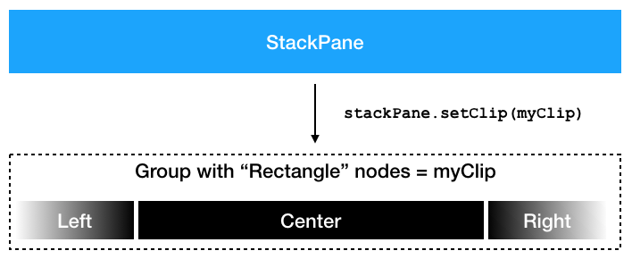
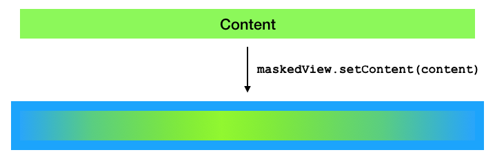

### Selection Strip

I recently had to implement a custom control that lets the user select a single item out of a list of items. This “SelectionStrip” control had to lay out the items horizontally and in case of too many items allow the user to scroll horizontally left and right. The control was to be used in a space-constrained area, so the buttons for scrolling should only appear when needed. They also should not waste any additional space when showing. So I decided to place them on top of the control on the left and right sides. All of this was easily achieved, except that it was now difficult to distinguish the scroll buttons from the items. This can be seen in the three images below.

[]()

[]()

[]()

### Alpha Channel?

So I thought it would be nice to somehow fade out the items when they are close to the left or right edge. This kind of behavior can normally be accomplished by using the alpha channel. It could decrease the opacity of pixels as their distance to the edges decreases. OK ….. but how is this done in JavaFX? For quite some time I was looking at the various “blend modes” that can be used to define how two overlapping nodes are drawn on top of each other. However, this was the wrong direction to look. As it turned out I already could have known how to do it because I once wrote a blog article talking about clipping and the difference between a filled and a non-filled clip. But I guess this was too long ago and I did not make the connection between “filled” and “filled with opacity less than 1”.

### Complex Clip!

So far most of the clips I used for custom controls were simple rectangles. They usually made sure that children nodes that reached outside the layout bounds of their parent control were not or only partially visible. But this clip was different, it was more complex. It had to define three different zones. A “fade-in” area on the left-hand side, a “full opacity” area in the center, and a “fade-out” area on the right-hand side. For this to work I defined a “Group” that consists of three filled “Rectangle” nodes. While the fill color of the center rectangle is a solid black, the fill colors of the other two rectangles are linear gradients going from transparent to black and vice versa. The image below illustrates this.

[]()

With this setup we can now add any node as a child to the stack pane and it will be drawn with fade-in and fade-out effects on its sides.

[]()

### Result

When applied to the “SelectionStrip” control from the beginning the scroll arrows / buttons are now always nicely visible and the overall user experience has become a little bit more pleasing. It is these little details that make the difference between a UI that is considered a “student project” or a “commercial application”. So sometimes it is really worth investing time in them.

[]()

[]()

[]()

### Source Code

I put the masking logic into a custom control called “MaskedView”. At the bottom of this post you will see the Gist (or the link to the Gist) that contains the source code of this control. Think of it as a wrapper around a given content node.

```java
import javafx.beans.property.DoubleProperty;
import javafx.beans.property.SimpleDoubleProperty;
import javafx.beans.property.SimpleObjectProperty;
import javafx.scene.Node;
import javafx.scene.control.Control;
import javafx.scene.control.Skin;

public class MaskedView extends Control {

    public MaskedView(Node content) {
        setContent(content);
    }
    
    @Override
    protected Skin<?> createDefaultSkin() {
        return new MaskedViewSkin(this);
    }
    
    private final SimpleObjectProperty<Node> content = new SimpleObjectProperty<>(this, "content");

    public final Node getContent() {
        return content.get();
    }
    
    public final SimpleObjectProperty<Node> contentProperty() {
        return content;
    }
    
    public final void setContent(Node content) {
        this.content.set(content);
    }
    
    private final DoubleProperty fadingSize = new SimpleDoubleProperty(this, "fadingSize", 120);

    public final double getFadingSize() {
        return fadingSize.get();
    }
    
    public final DoubleProperty fadingSizeProperty() {
        return fadingSize;
    }

    public final void setFadingSize(double fadingSize) {
        this.fadingSize.set(fadingSize);
    }
}
```

```java
import javafx.beans.InvalidationListener;
import javafx.beans.WeakInvalidationListener;
import javafx.scene.Group;
import javafx.scene.Node;
import javafx.scene.control.SkinBase;
import javafx.scene.layout.StackPane;
import javafx.scene.paint.Color;
import javafx.scene.paint.CycleMethod;
import javafx.scene.paint.LinearGradient;
import javafx.scene.paint.Stop;
import javafx.scene.shape.Rectangle;

public class MaskedViewSkin extends SkinBase<MaskedView> {

    private final Rectangle leftClip;
    private final Rectangle rightClip;
    private final Rectangle centerClip;
    private final Group group;
    private final StackPane stackPane;
    
    public MaskedViewSkin(MaskedView view) {
        super(view);
        leftClip = new Rectangle();
        rightClip = new Rectangle();
        centerClip = new Rectangle();
        centerClip.setFill(Color.BLACK);
        
        leftClip.setManaged(false);
        centerClip.setManaged(false);
        rightClip.setManaged(false);
        
        group = new Group(leftClip, centerClip, rightClip);
        stackPane = new StackPane();
        stackPane.setManaged(false);
        stackPane.setClip(group);
        getChildren().add(stackPane);
        view.contentProperty().addListener((observable, oldContent, newContent) –> buildView(oldContent, newContent));
        
        buildView(null, view.getContent());
        view.widthProperty().addListener(it –> updateClip());
        view.fadingSizeProperty().addListener(it –> updateClip());
    }

    private final InvalidationListener translateXListener = it –> updateClip();

    private final WeakInvalidationListener weakTranslateXListener = new WeakInvalidationListener(translateXListener);

    private void buildView(Node oldContent, Node newContent) {
        if (oldContent != null) {
            stackPane.getChildren().clear();
            oldContent.translateXProperty().removeListener(weakTranslateXListener);
        }
        if (newContent != null) {
            stackPane.getChildren().setAll(newContent);
            newContent.translateXProperty().addListener(weakTranslateXListener);
        }
        updateClip();
    }

    private void updateClip() {
        MaskedView view = getSkinnable();
        Node content = view.getContent();
        if (content != null) {
            double fadingSize = view.getFadingSize();
            if (content.getTranslateX() < 0) {
                leftClip.setFill(new LinearGradient(0, 0, fadingSize, 0, false, CycleMethod.NO_CYCLE, new Stop(0, Color.TRANSPARENT), new Stop(1, Color.BLACK)));
            } else {
                leftClip.setFill(Color.BLACK);
            }
            if (content.getTranslateX() + content.prefWidth(–1) > view.getWidth()) {
                rightClip.setFill(new LinearGradient(0, 0, fadingSize, 0, false, CycleMethod.NO_CYCLE, new Stop(0, Color.BLACK), new Stop(1, Color.TRANSPARENT)));
            } else {
                rightClip.setFill(Color.BLACK);
            }
        }
        view.requestLayout();
    }

    @Override
    protected void layoutChildren(double contentX, double contentY, double contentWidth, double contentHeight) {
        double fadingSize = Math.min(contentWidth / 2, getSkinnable().getFadingSize());
        stackPane.resizeRelocate(snapPosition(contentX), snapPosition(contentY), snapSpace(contentWidth), snapSpace(contentHeight));
        resizeRelocate(leftClip, snapPosition(contentX), snapPosition(contentY), snapSpace(fadingSize), snapSpace(contentHeight));
        resizeRelocate(centerClip, snapPosition(contentX + fadingSize), snapPosition(contentY), snapSpace(contentWidth – 2 * fadingSize), snapSpace(contentHeight));
        resizeRelocate(rightClip, snapPosition(contentX + contentWidth – fadingSize), snapPosition(contentY), snapSpace(fadingSize), snapSpace(contentHeight));
    }

    private void resizeRelocate(Rectangle rect, double x, double y, double w, double h) {
        rect.setLayoutX(x);
        rect.setLayoutY(y);
        rect.setWidth(w);
        rect.setHeight(h);
    }
}
```