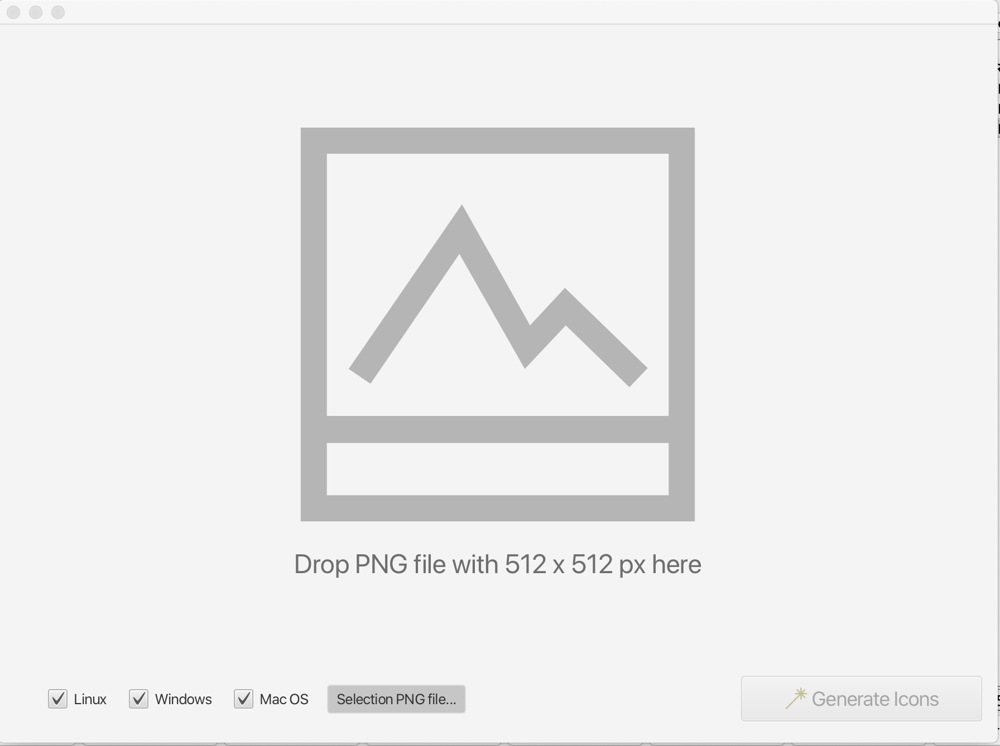

# FXIconcreator
Small app to create icon sets (multi resolution) for Linux, Windows, OSX from a single PNG image

Reason for creating such an app was that I had to create app icons out of png files but I was tired to always fire up different virtual machine only to use the native tools to create the icons. All web based icon converter are converting the icons in the wrong format (not as multi resolution).

All the credit goes to the following opensource projects:
- Javafx https://openjfx.io/
- iKonli https://github.com/kordamp/ikonli
- ICNS imcdonagh https://github.com/gino0631/icns
- ICO #imcdonagh https://github.com/imcdonagh/image4j

You can build the app via cmd "mvn clean install" inside of the directory where the pom.xml file exists

