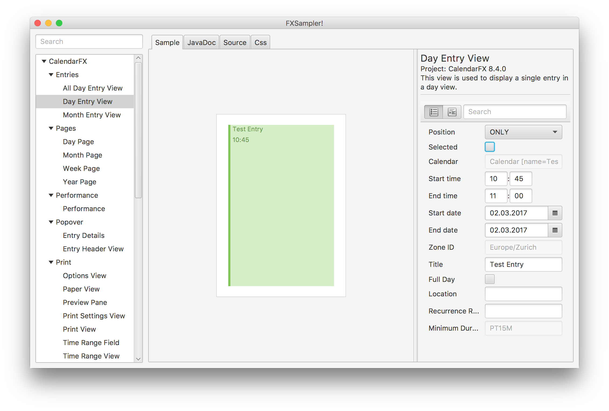
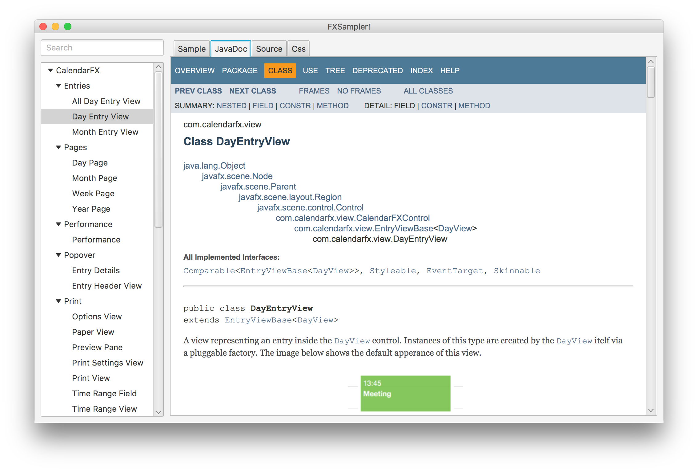
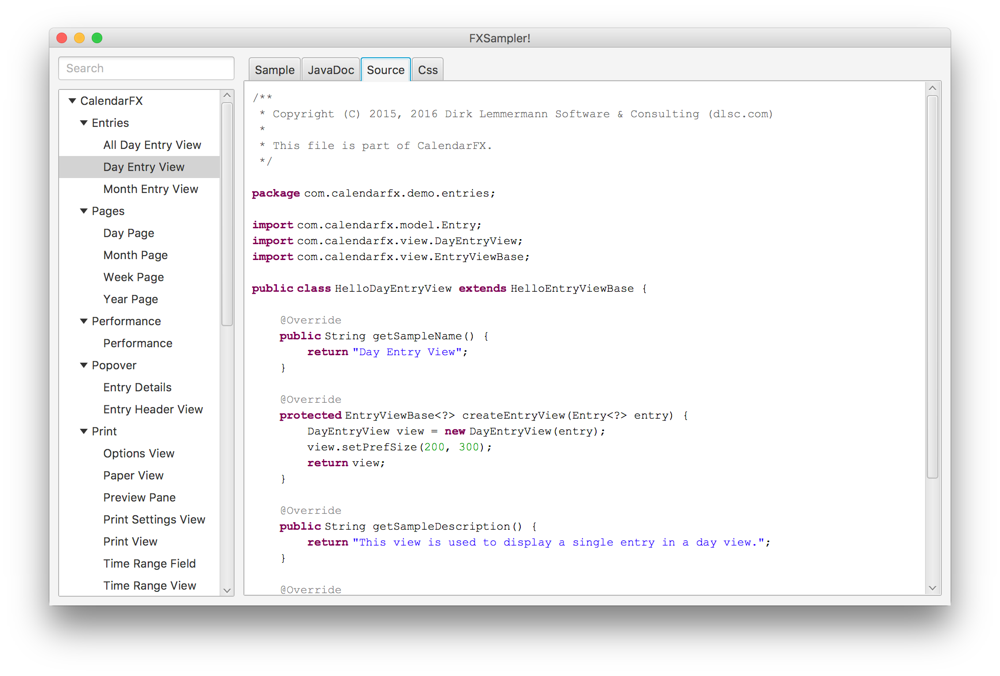
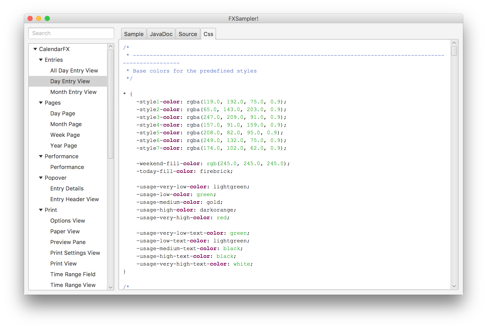
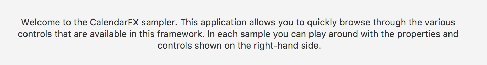
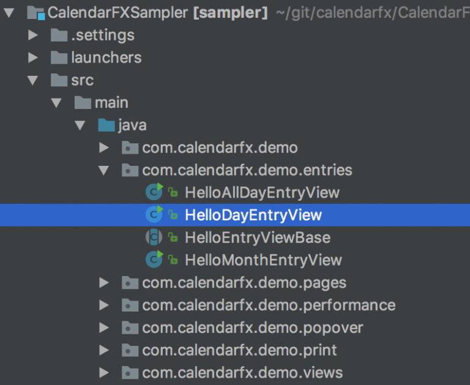
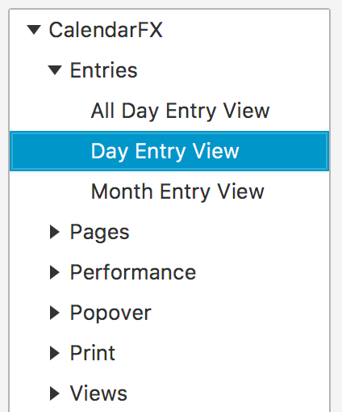
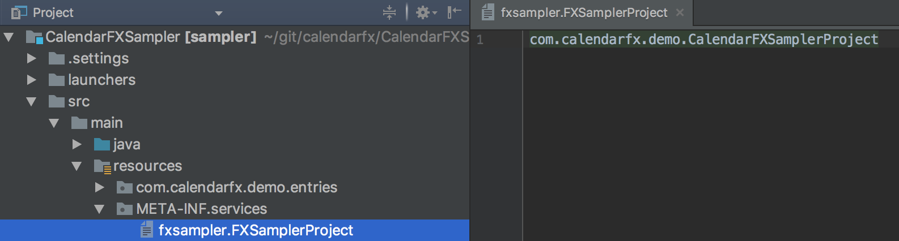

As a framework developer it is essential to have an easy way to individually test the appearance of 
and the interaction with each custom control. When doing UI work you constantly make changes to your 
controls and look at the impact of those changes. If a single change roundtrip (code, launch, test) 
takes 5 minutes then you can only squeeze 12 change iterations into an hour, making slow progress. 
If it takes 1 minute then you are looking at 60 iterations and fast progress. As simple as that.

### The Solution

Luckily the *ControlsFX* project contains a very nice subproject called FXSampler, which is a generic 
sampler application for any JavaFX framework. The screens below show the individual CalendarFX samples 
in a hierarchical tree structure on the left-hand side. The selected sample shows up in the center pane. 
In this case it is showing the view used for visualizing a calendar entry on a weekday. The property 
sheet on the right-hand side allows the user to edit the properties of the selected control. It should 
be noted that the right-hand side can show any kind of control for interacting with the sample, it 
does not have to be a property sheet. However, very often the property sheet is the fastest way of coming 
up with a good way of manipulating the control.



The center pane has several tabs. The first one shows the actual sample. The second one displays the 
javadocs / API of the control. Ideally each sample shows exactly the API of the featured control and 
not just the index page of the entire framework API. Which page gets loaded into this tab can be 
configured individually for each sample.



The next tab is used for showing source code. This can be any code that is relevant for the 
sample but in most cases it shows the code of the sample itself.



Tab number four contains CSS styling information that is relevant for the selected sample. If your 
control overrides the `getUserAgentStylesheet()` method then the tab should display the stylesheet that 
is returned by this method.



### The Setup

It is suggested that frameworks use a multi-module Maven setup and add a separate module just for the 
samples. The `pom.xml` file of this module has to contain a dependency to *FXSampler* like this:

```xml
<dependency>
   <groupId>org.controlsfx</groupId>
   <artifactId>fxsampler</artifactId>
   <version>1.0.11</version>
</dependency>
```

The next thing needed is a class that represents the sampler project. The class has to implement the 
`fxsampler.FXSamplerProject` interface. It is used to specify a project name, a base package, and a welcome 
page. The code below shows the implementation of this interface as it was done for *CalendarFX*.

```java
package com.calendarfx.demo;

import fxsampler.FXSamplerProject;
import fxsampler.model.WelcomePage;

public class CalendarFXSamplerProject implements FXSamplerProject {

    @Override
    public String getProjectName() {
        return "CalendarFX";
    }

    @Override
    public String getSampleBasePackage() {
        return "com.calendarfx.demo";
    }

    @Override
    public WelcomePage getWelcomePage() {
        return new CalendarFXSamplerWelcome();
    }
}
```

### Welcome Page

The welcome page is optional and allows the developer to specify a title for the sampler and to show a UI that 
will be presented to the user when the sampler application starts up. The *CalendarFX* sampler shows a 
simple “about message”.



### Base Package

*FXSampler* will use the “base package” to find all classes that are samples. *FXSampler* will place the 
samples found in the base package at the top of the navigation tree on the left-hand side of its window. 
Samples found in sub packages will end up in a tree node. The image below shows the package structure of 
the CalendarFX sampler project.



The base package for *CalendarFX* is com.calendarfx.demo and because the “day entry view” sample was 
found inside the entries package it means that the sample will be displayed in a tree node called 
“Entries”. The next image shows how the navigation tree reflects the package structure.



You will notice that the samples are all prefixed with “Hello…”. This is simply a convention inherited 
from the *ControlsFX* project. There is no technical reason for it.

### The Samples

A class becomes a sample if it implements the `fxsampler.Sample` interface. But it is even better if 
the class extends from `fxsampler.SampleBase`. The clever thing about this class is that it extends from
Application, which means that each sample can also be run standalone.

A sample defines / contains the following things:

- The name of the sample (in our example “Day Entry View”).
- A short description of the sample / the control (what does it do? what is it used for?).
- The name of the project that is belongs to.
- The project version (e.g. 8.4.0).
- A node that will be placed in the center pane and that displays the custom control.
- A control panel for manipulating / interacting with the sample (right-hand side, often a property sheet).
- The position of the control panel divider handle (based on the width requirements of the control panel).
- The URL to the JavaDocs (I always point to the docs on my server).
- The URL to the stylesheet that is relevant for the sample.
- The URL to the source code of the sample.
- A flag to indicate if the sample is currently visible (good for hiding samples that are still work-in-progress).

### The Launcher

To run the sampler project we need a class with a `main()` method that extends the JavaFX `Application` class. 
Luckily *FXSampler* ships a class called `fxsampler.FXSampler`. For *CalendarFX* it looks like this:

```java
package com.calendarfx.demo;

import fxsampler.FXSampler;
import javafx.stage.Stage;

public class CalendarFXSampler extends FXSampler {

    @Override
    public void start(Stage primaryStage) {
        super.start(primaryStage);
    }

    public static void main(String[] args) {
        FXSampler.main(args);
    }
}
```

You will notice that the launcher does not reference / instantiate any specific sampler project. You 
would normally expect to see the  launcher create an instance of `CalendarFXSamplerProject` but its’ `main()` 
method simply delegates to the `main()` method of *FXSampler*. So how does it find anything?

### The Service Provider

The answer is simple but not something that every Java developer has encountered in their day-to-day coding 
routine. *FXSampler* finds the sampler project because it will be registered as a **service provider**. This is 
done by adding a file to the directory `META-INF/services`. The file name has to be `fxsampler.FXSamplerProject`. 
Inside the file we add the full class name of the sampler project. *FXSampler* can now lookup all service 
providers that implement the FXSamplerProject and instantiate them. This allows *FXSampler* to show the samples 
found in several JARs at the same time. If we wanted to we could create a single application showcasing the 
samples found in *FlexGanttFX*, *CalendarFX*, and *ControlsFX* at the same time. The image below shows the 
location of the service provider file and its content inside the `CalendarFXSampler` module.



### Service Provider & Module System

In Java 11+ projects often use the Java module system. If your application is one of them then you also need to make
changes to the `module-info.java` file. For CalendarFX it would look like this:

```java
provides fxsampler.FXSamplerProject with com.calendarfx.demo.CalendarFXFXSamplerProject;
uses fxsampler.FXSamplerProject;
```
