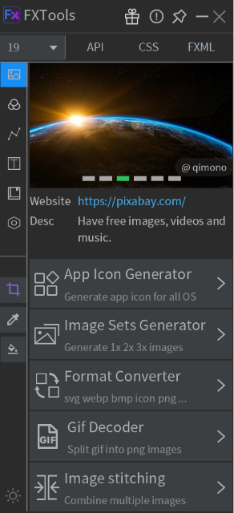
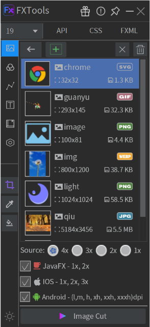
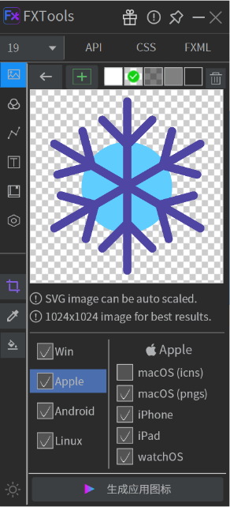
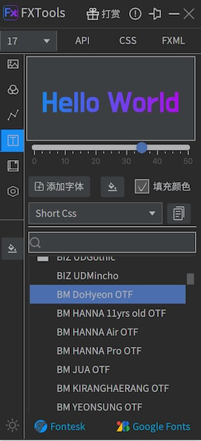

# FXTools

A practical desktop toolkit for JavaFX developers, providing image processing, color picking, SVG path extraction, font preview, and more.

## Features

**Image Tools**
- App Icon Generator for Windows, macOS, Linux, iOS, Android
- Image Sets Generator (1x, 2x, 3x for JavaFX, iOS, Android)
- Format Converter (SVG, WebP, PNG, BMP, JPG, GIF)
- GIF Decoder and Image Stitching

**Color Tools**
- Screen color picker
- Generate JavaFX CSS or Java code
- 20+ color palette references
- Convert between HSB, RGB, HSL, Hex

**SVG Tools**
- Preview SVG Path in JavaFX
- Extract Path attribute from SVG files
- Generate JavaFX CSS or Java code

**Font Tools**
- Preview system and external fonts
- Generate JavaFX CSS or Java code

## Download

- [Windows / macOS / Linux](https://github.com/leewyatt/FXTools/releases)

## Tutorials

- [Video Introduction (YouTube)](https://youtu.be/lDj1Wa_2IfM)

## Resources

- GitHub: [https://github.com/leewyatt/FXTools](https://github.com/leewyatt/FXTools)
- Issues: [https://github.com/leewyatt/FXTools/issues](https://github.com/leewyatt/FXTools/issues)

## Screenshots

