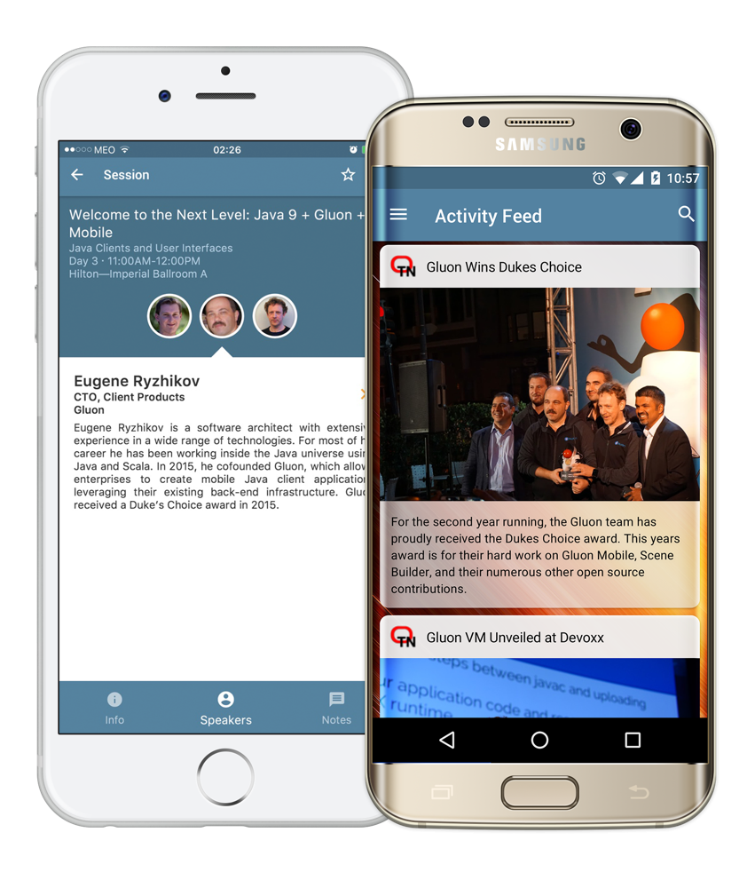

# Gluon Mobile

Gluon mobile provides fresh, modern UIs, cloud connectivity, and hardware access for JavaFX applications
running on mobile devices.

## Java End-to-End

Harness your existing Java knowledge:

* Build a single application in Java – use the same APIs regardless of device
* Deploy to all platforms privately or via the various app stores
* Massively improve time-to-market – less code and less testing

The guiding principle of Gluon Mobile is to ensure that developers can create high performance, great looking,
and cloud connected mobile apps from a single Java code base, for iOS and Android.

## Device & Platform Agnostic Native Hardware Services

Make use of hardware features on mobile devices in a platform-agnostic way. Gluon Mobile makes available all
the storage systems, accelerometers, screen details, GPS devices, and more in a device-independent fashion.
This support is implemented inside the ["Attach" project](https://gluonhq.com/products/mobile/attach/).

## Connect to Cloud Services

Gluon Mobile includes a full web services API to make connecting to and consuming web services straight forward.

* Connect to [Gluon CloudLink](https://gluonhq.com/products/cloudlink/), or any other web service, with ease
* Bi-directional, automatic data synchronization
* User authentication using popular web services such as Twitter, Facebook, Google+, or a custom login

## High Performance: Mobile applications that fly

Gluon Mobile apps place a high priority on high performance:

* Gluon Mobile apps run natively on mobile devices using all hardware features to accelerate rendering.
* Developers can use Java 11+ language features and APIs, thanks to the [GraalVM](https://www.graalvm.org/)

## Drag & Drop, Rapid Application Development

Tools for developers and designers can make or break the app development experience

* Scene Builder is a free drag & drop user interface designer, allowing for rapid iteration
* Scene Builder ensures a separation between design and logic files – team members can quickly and easily focus on their
  specific layer of application development
* Gluon provides free IDE plugins for IntelliJ IDEA, Eclipse, and NetBeans, to support developers with templates,
  wizards, and other tools
