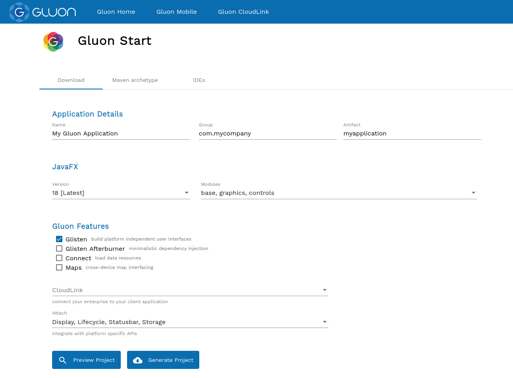

Gluon Start is a website which enables you to generate the structure and skeleton of your Java client application.

  

You can configure the following properties of the application:

- Name, groupId and artifactId to use for the generated Maven project.
- JavaFX version and modules required by the project.
- Gluon Mobile stack to include in the project. For example, Glisten (for the UI toolkit) and Gluon Maps can be selected to be used in the same project.
- Gluon Attach services required in the project.
- If the application needs a flexible and secure way to connect to an existing or new backend or cloud service, Gluon CloudLink can be selected as well.

All options are easily selectable and Gluon Start will generate the project with correct dependencies for you!  