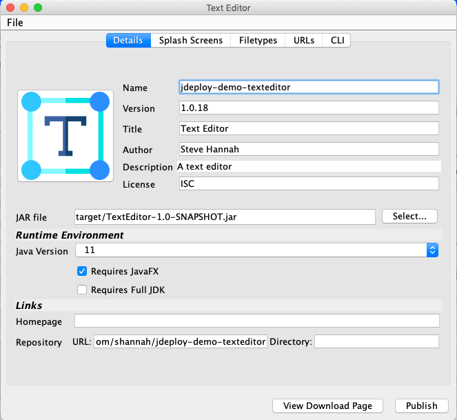
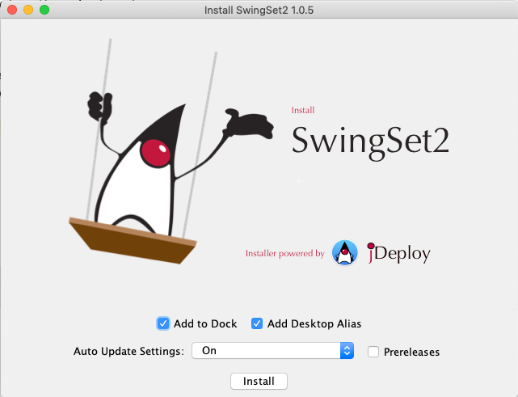

# jDeploy

[jDeploy](https://www.jdeploy.com/) allows Java developers to deploy desktop applications as native bundles on Macintosh, Windows, and Linux. Unlike other deployment solutions, jDeploy doesn’t require any third party tools (other than OpenJDK), and can build native installers for Mac, Windows, and Linux on any platform. For example, you can build a native Windows installer on Linux or Mac, and vice versa. Applications deployed using jDeploy can also receive updates automatically as they become available, so you can be assured that your users will always be working with the latest version of your application.

## GUI

jDeploy provides a graphical user interface that makes it easy to configure your app’s deployment settings such as icons, splash screens, file associations, etc…​ After you’re satisfied with the settings, press "Publish", and it will publish your app so that users can download the latest version.

## Download Page

When you publish your application using jDeploy, your users will instantly be able to download your app at https://www.jdeploy.com/~YOUR-APP-NAME. This download page includes links for Windows, Mac, and Linux. 

## Installer

The installer downloaded from the download page will prompt the user to select relevant installation options, such as whether to add a link in the Dock (Mac only), or the Start Menu (Windows Only), and whether to enable auto-update (default "On").

After selecting the desired options, the user can press the Install button, which will trigger the installation of your app. This will only take a second, and, when complete, the user will be prompted with a dialog as follows:

## Documentation

You can find the full documentation with a lot of info, for instance how to automate the packaging with GitHub Actions, on [deploy.com/docs/manual](https://www.jdeploy.com/docs/manual/).

