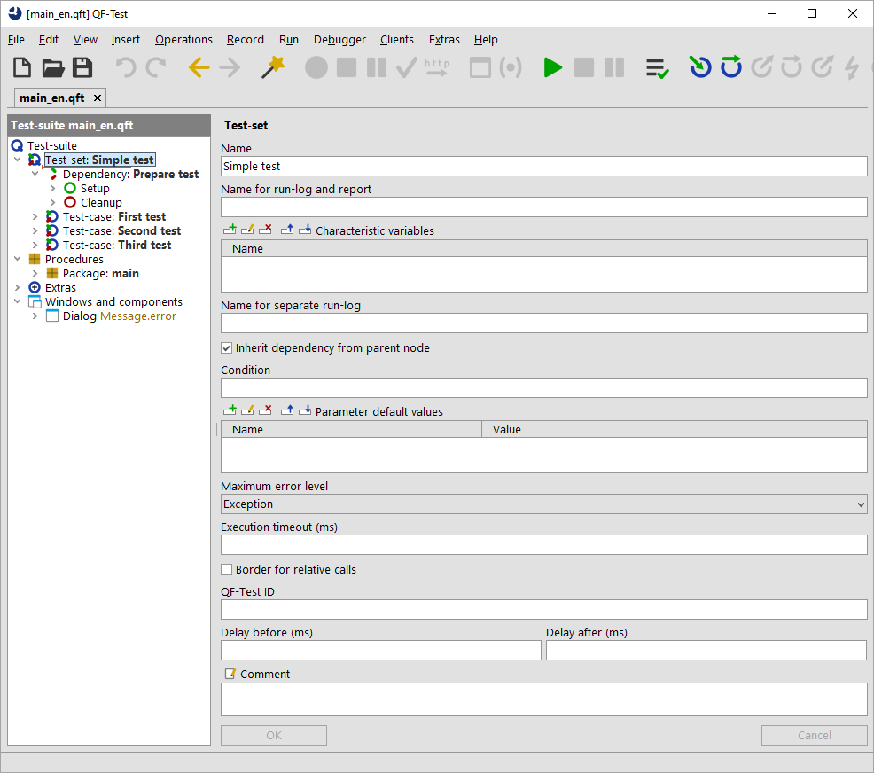

QF-Test supports all simple and complex JavaFX controls including complex components like trees and tables. QF-Test can test hybrid JavaFX applications with an embedded browser like e.g. JxBrowser or WebView. You can access both the Java and Web part of the application. With Webswing and JPro you can bring JavaFX applications into the web as SAS. Existing tests can be reused as is.

### Quick start for everyone

Get first test results fast with the Quickstart wizard that recognizes your application's technology automatically and if required, we provide support.

### Tool for QA engineers and developers

QF-Test is user-friendly and easy to use for users without programming knowledge.
Users with developer background get their money's worth with scripting.
