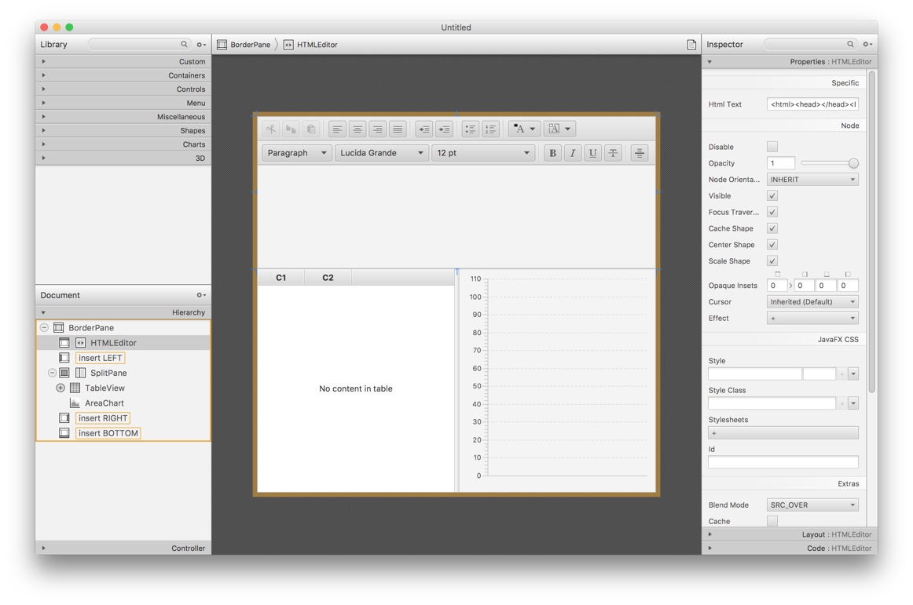

# Scene Builder

JavaFX Scene Builder provides a visual layout environment that lets you quickly design user interfaces (UI) for
JavaFX applications without needing to write any code. It allows simple drag-and-drop positioning of graphical
user interface (GUI) components onto a JavaFX scene. As you build the layout of your UI, the FXML code for the
layout is automatically generated. JavaFX Scene Builder provides a simple yet intuitive interface that can help
even non programmers to quickly prototype interactive applications that connect GUI components to the application
logic.

## Integrated

Scene Builder works with the JavaFX ecosystem – official controls, community projects, and Gluon offerings
including [Gluon Mobile](https://gluonhq.com/products/mobile/), [Gluon Desktop](https://gluonhq.com/products/desktop/),
and [Gluon CloudLink](https://gluonhq.com/products/cloudlink/).

## Simple

Drag & Drop user interface design allows for rapid iteration. Separation of design and logic files allows for
team members to quickly and easily focus on their specific layer of application development.

## Supported

Scene Builder is free and open source, but is backed by
Gluon. [Commercial support offerings](https://gluonhq.com/services/) are available,
including [training](https://gluonhq.com/services/training/) and
custom [consultancy services](https://gluonhq.com/services/consulting/).