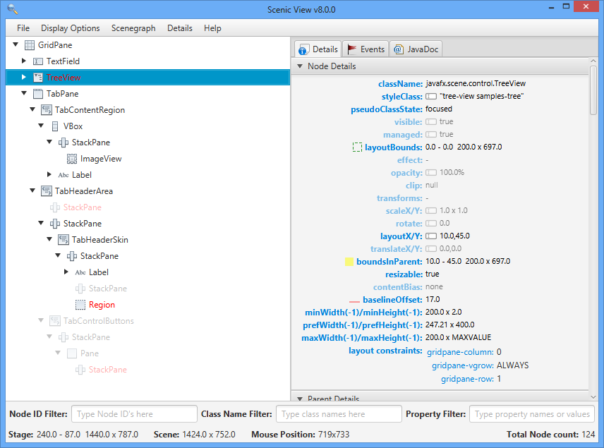

# Scenic View

Scenic View is a JavaFX application designed to make it simple to understand the current state of your application
scenegraph, and to also easily manipulate properties of the scenegraph without having to keep editing your code.
This lets you find bugs, and get things pixel perfect without having to do the compile-check-compile dance.



## Downloads

Builds for JDK 11 for Windows, Linux, and MacOS are built by Azure Pipelines, and downloads are available from the
following links:

| Platform | Download for JDK 11                                                                          |
|----------|----------------------------------------------------------------------------------------------|
| Windows  | [Download](https://download.jonathangiles.net/downloads/scenic-view/scenicview-21-win.zip)   |
| MacOS    | [Download](https://download.jonathangiles.net/downloads/scenic-view/scenicview-21-mac.zip)   |
| Linux    | [Download](https://download.jonathangiles.net/downloads/scenic-view/scenicview-21-linux.zip) |

You can also download platform-independent releases
for [JDK 8](https://download.jonathangiles.net/downloads/scenic-view/scenic-view-8.7.0.zip)
and [JDK 9](https://download.jonathangiles.net/downloads/scenic-view/scenic-view-9.0.0.zip).

## Using Scenic View

### Stand-alone application

Download the Scenic View custom image for your platform from the above links. Unzip and then run:

```
cd scenicview/bin
./scenicView
```

Also, you can clone or download this project, and run Scenic View as stand-alone application:

```
./gradlew run
```

or if you build a custom image:

```
cd build/scenicview/bin
./scenicView
```

Then run a JavaFX application, and it will be detected by Scenic View.

Alternatively, you can also run the `scenicview.jar` in any platform, providing that JDK 11 and JavaFX SDK 11 are
installed:

```
cd build/libs/
java --module-path /path-to/javafx-11-sdk/lib --add-modules javafx.web,javafx.fxml,javafx.swing -jar scenicview.jar
```

#### Notes

- Scenic View will detect JavaFX applications running on Java 9, 10 or 11.

- If the JavaFX application runs from a custom image (created via `link` or `jpackage`), it won't
  have access to some required tools that are available when it runs from a regular JDK, and Scenic View won't be
  able to find it.

### As a dependency

You can add `scenicview.jar` as a dependency to your JavaFX application. Since this jar doesn't include
the JavaFX dependencies, you should add them to your project, in case these weren't included yet.

For instance, if you are running a Gradle project, add the jar to a `libs` folder, then add it to the `build.gradle`
file, like:

```
plugins {
  id 'application'
  id 'org.openjfx.javafxplugin' version '0.0.7'
}

repositories {
  mavenCentral()
}

dependencies {
  implementation files('libs/scenicview.jar')
}

javafx {
  modules = ['javafx.web', 'javafx.fxml', 'javafx.swing']
}
```

Also add it to the `module-info.java` file requirements:

```
requires javafx.controls;
requires javafx.fxml;
requires transitive javafx.web;
requires transitive javafx.swing;

requires org.scenicview.scenicview;
```

Finally, you can run it from the application class:

```
Scene scene = new Scene(root);
stage.setScene(scene);
stage.show();
        
ScenicView.show(scene);
```

## License

GNU General Public License v3.0-or-later

## Contributing

This project welcomes all types of contributions and suggestions.
We encourage you to report issues, create suggestions and submit pull requests.

Please go through the [list of issues](https://github.com/JonathanGiles/scenic-view/issues)
to make sure that you are not duplicating an issue.