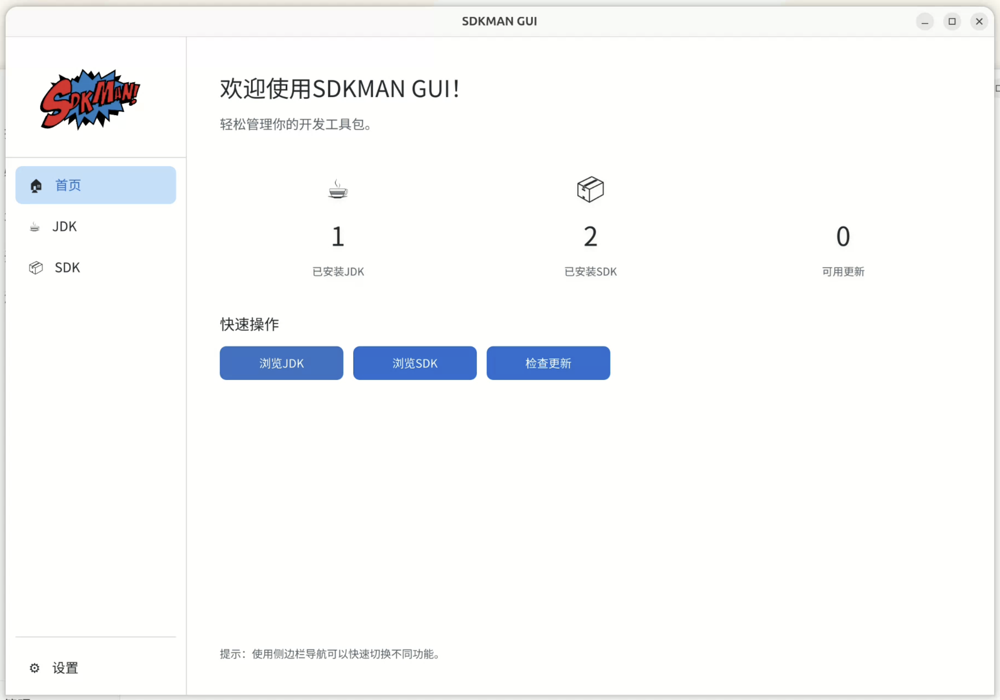
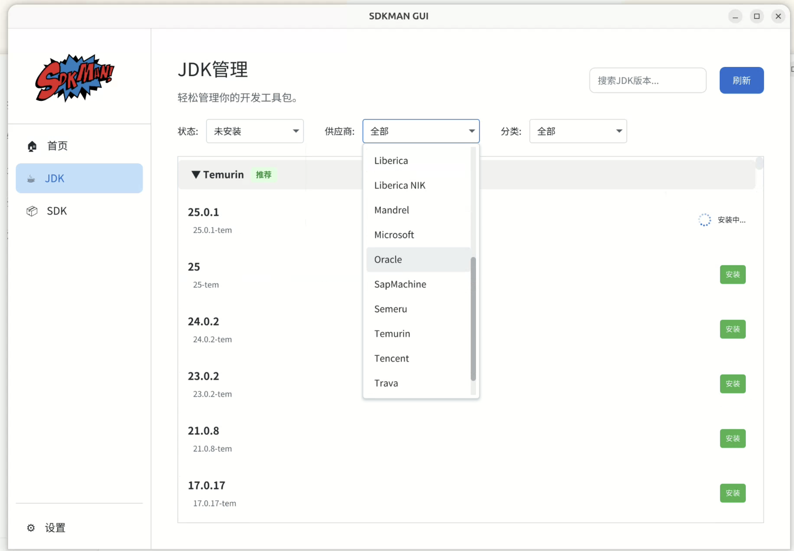
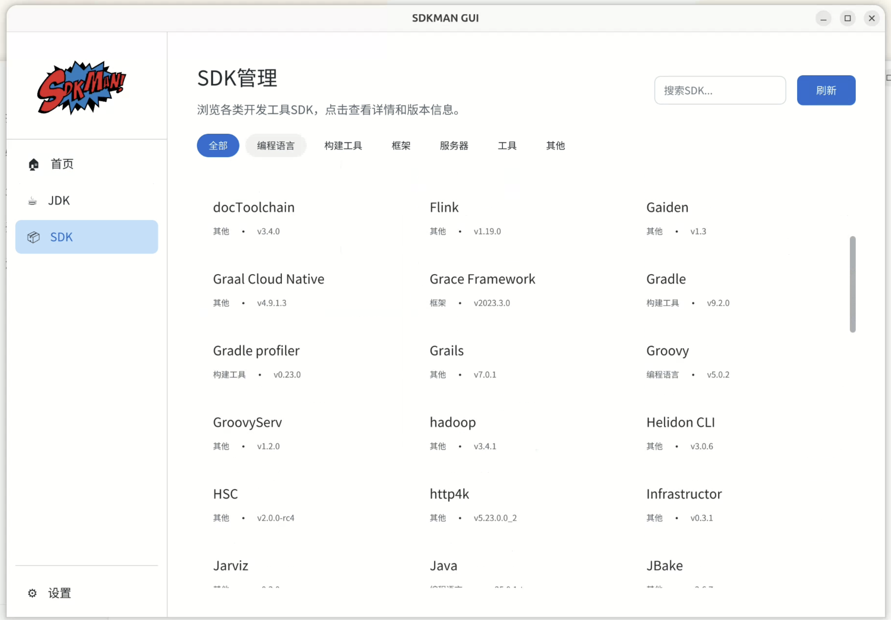
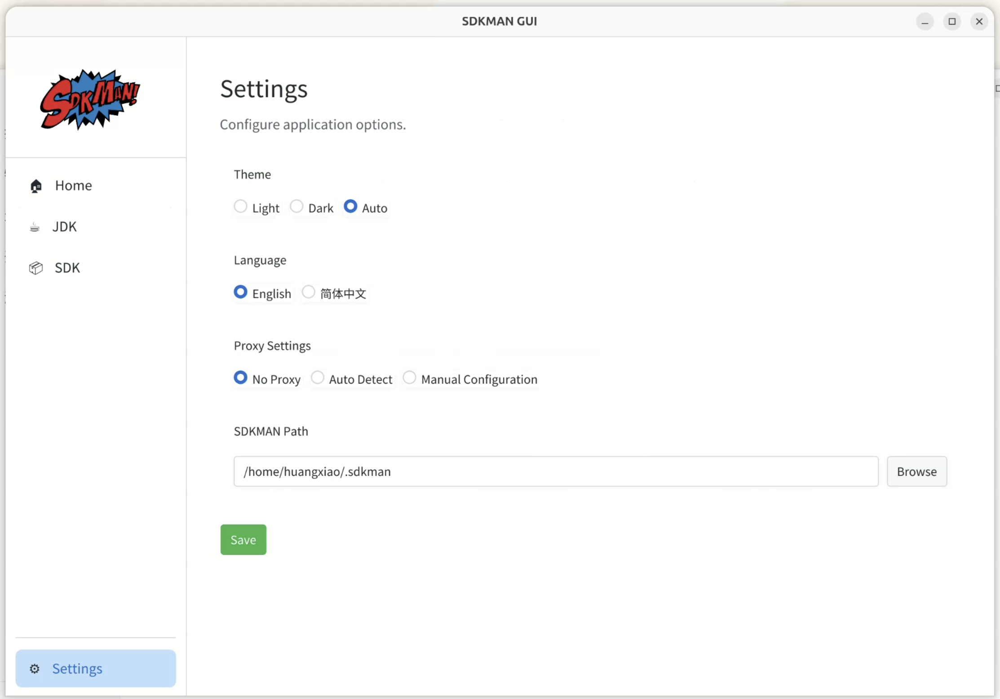

# SDKMAN GUI

**English** | [中文](README_ZH.md)

> A modern graphical management tool for [SDKMAN](https://github.com/sdkman), providing an [Applite](https://github.com/milanvarady/Applite)-like user experience.

Built with JavaFX 25 + Maven 4.0, inspired by Applite's design aesthetic, offering an elegant GUI interface for SDKMAN.

## 🎬 Demo

**[📹 Watch Demo Video (sdkman-gui.webm)](sdkman-gui.webm)**

## ✨ Features

- 🎨 **Modern UI** - Beautiful interface design based on AtlantaFX themes
- 🌍 **Internationalization** - Support for English and Chinese with automatic system language detection
- 🌗 **Theme Switching** - Support for light/dark themes
- 📦 **SDK Management** - Browse, install, uninstall, and switch SDK versions
- 🔍 **Search & Filter** - Quickly find the SDKs you need
- 🏷️ **Category Browsing** - View SDKs by category (Java, Build Tools, Programming Languages, etc.)
- 🔄 **Update Checking** - Automatically detect SDK updates
- ⚙️ **Configuration Management** - Flexible application configuration