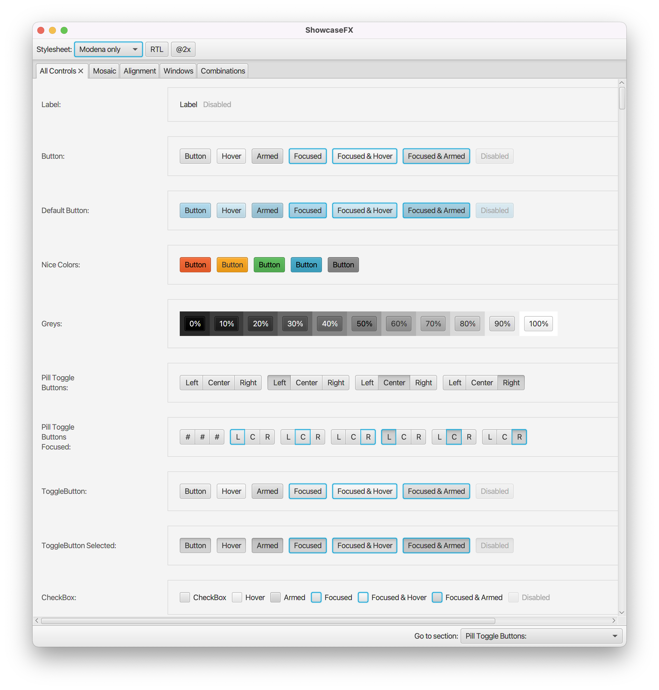

# ShowcaseFX

*At least **JDK 11** is required.*

[](https://search.maven.org/search?q=g:com.dlsc.showcasefx%20AND%20a:showcasefx)

This project contains a single control called `CssShowcaseView` that can be used to preview the results produced by adding one or more stylesheets on top of the built-in modena stylesheet. This view can be run as part of a standalone CSS testing application or integrated into a customer application as a developer option.

### Screenshot



### Standalone Usage

The project includes an application class called ShowcaseFX. It will open a window with the CssShowcaseView as its primary control. The user can load stylesheets via the **_File_** menu or via drag and drop. Both operations can be done with either a single file or multiple files at the same time. To run the application simply call `mvn javafx:run` or download an executable of your choice.

### Embedded Usage

```java
// A CSS configuration with three stylesheets that will be used to
// extend the built-in Modena.css file.
CssConfiguration config = new CssConfiguration("My Style", 
        "url/to/stylesheet1.css", 
        "url/to/stylesheet2.css", 
        "url/to/stylesheet3.css");

CssShowcaseView view = new CssShowcaseView();
view.getConfigurations().add(config);
view.setSelectedConfiguration(config);

// then add pane to your UI
```
