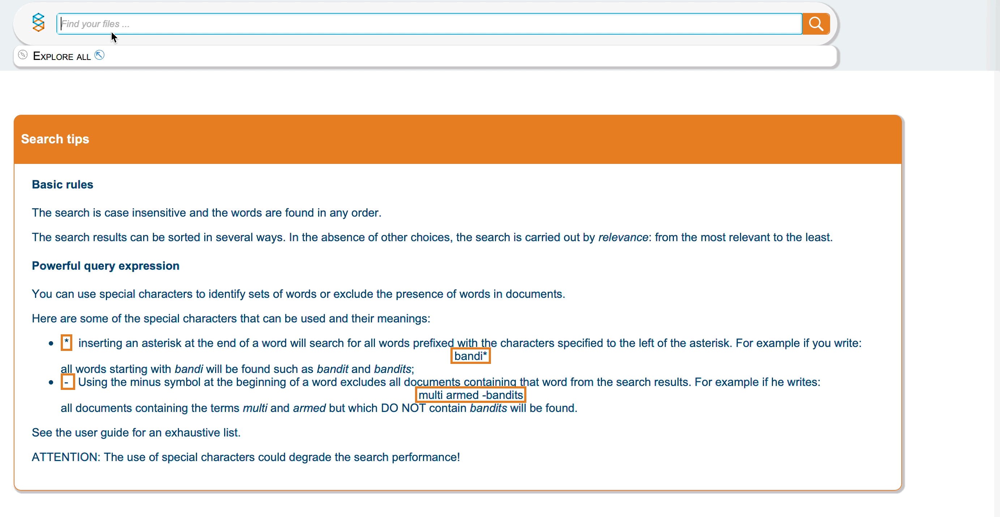
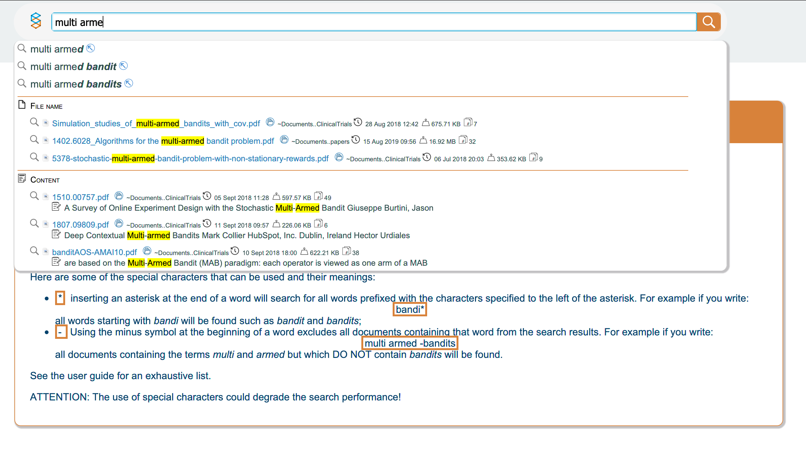
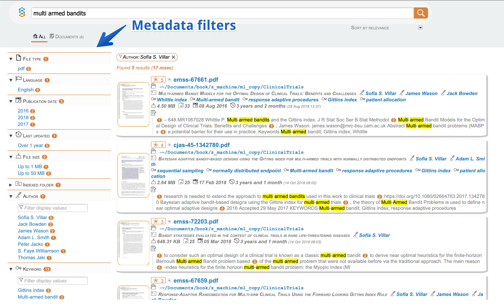
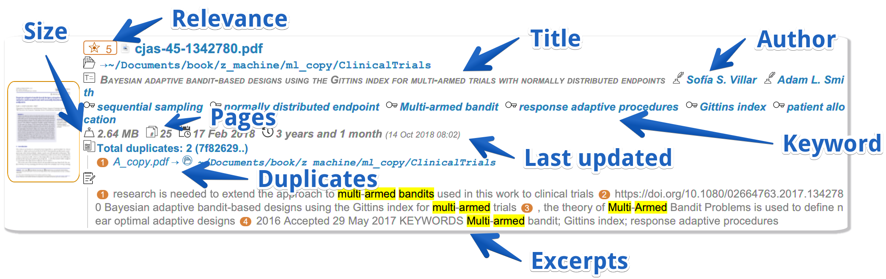
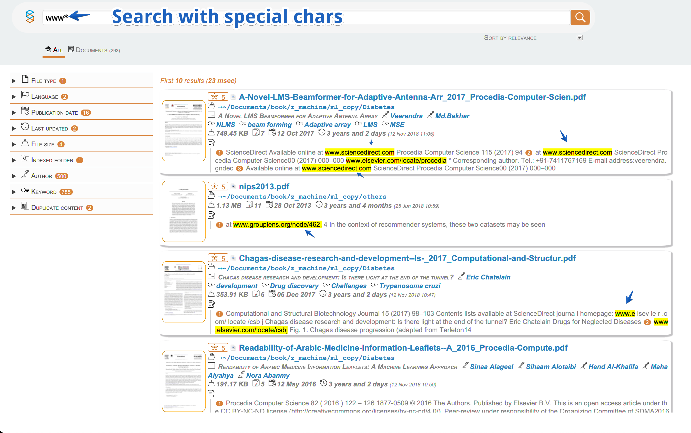

SmartFinder is a Desktop Search tool that allows you to use an innovative way to search for your files on the Desktop with an experience similar to Google's search!

With SmartFinder you have everything just a click away and in a single view!
From the ability to open the first relevant files already while typing the words to be searched, to links with meta-data to directly filter the results, to viewing an extract of the document with the searched words highlighted!
What if you need to know which files have the same content? Yes, with SmartFinder you can do this and much more, read all the product features we have developed to make you always find what you are looking for and more. Look all features on our dedicated page [SmartFinder page link](https://serendigity.it/products/smartfinder/)

The solution is intended for anyone who has to manage many files and has to find the documents of interest in the shortest possible time and with the highest quality of results.

## Download Link

| Platform | Link|
|----------| ---------------------|
| Windows  | [Microsoft Store download link](https://www.microsoft.com/store/apps/9PD0BCV3WKD1) |
| MacOS    | It will be scheduled for publication on the Apple Store as soon as possible |

## Some screenshots

## License

Commercial License

## Some open source libraries used
* JavaFX
* Apache Lucene
* Apache Tika
