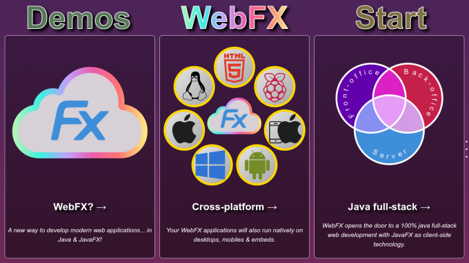

# WebFX

A new way to develop modern web applications... in Java and JavaFX. WebFX is a JavaFX to Javascript transpiler powered
by GWT. You write your web application in JavaFX, and GWT will transpile it to pure Javascript (no plugin, no server).
WebFX patches the higher layer of OpenJFX to make it GWT compatible, and replaces the lower layer with a "JavaFX scene
graph to browser" DOM mapper. You don't need to transpile each code change, you can use the OpenJFX runtime to develop,
test and debug your application as usual in your Java IDE, and transpile it only from time to time to check your web
version is working as expected. WebFX is new and doesn't yet cover all JavaFX features, but it has a lot of potential
and may quickly receive support from the JavaFX & GWT communities. WebFX is now ready for testing. We hope you will love
it.

_WebFX Website_

## Full Stack

WebFX makes 100% Java full-stack development possible, with JavaFX as the client-side technology. Web development is
transitioning to client-side technologies, and this often introduces heterogeneity in Java-based environments.
Standardizing your client stack with a JS front & back-office may be an option for sharing common client code, but your
stack is still heterogeneous. Switching to a pure JS stack may be a solution, but you would prefer to stay with Java,
right? With WebFX you can use JavaFX for your client-side web technology, and stick with Java throughout your stack. The
same language for all your stack. The same UI toolkit for your front & back-office. The same IDE for all your code. The
ideal solution for Java-based environments. Simply share common code between your front-office, back-office and server
using the Java module system.

## Cross Platform

Your WebFX applications will also run natively on desktops, mobiles & embeds. As with any JavaFX application, the JDK
toolchain will generate your WebFX application desktop executables (powered by an optimized JVM). In addition, the Gluon
toolchain will generate native executables for the desktop (no JVM - your application compiled into native by GraalVM),
and also for Android & iOS. Ideal for your front-end development. Gluon can even build your application for Raspberry
Pi, with its JavaFX runtime for embeds (more devices to come). And finally, WebFX compiles your application for the Web
platform. Perfect for your front-end development 7 platforms from a single code base! (check-out the demos for a Github
workflow example)

## Magical

WebFX generates fast and lightweight web apps despite the heavy JavaFX footprint. How is this possible? The resultant JS
code only needs to create a DOM rendered by the browser, and doesn't include the big JavaFX rendering layer, as opposed
to the desktop version. And GWT removes all dead code! This makes your JS code much thinner, incorporating only the
JavaFX classes required by your application. GWT is known to produce compact and highly optimized JS code, that
potentially runs faster than hand-rolled JS. And JavaFX itself is fast, because it's not a framework but
&ldquo;just&rdquo; a UI toolkit. No unwanted processing slowing things down. Here is the Lighthouse performance score
for this website. Isn't WebFX magical?

## Long Term

WebFX provides your applications with longevity. The lifespan of your web application is affected by the lifespan of its
UI toolkit. As the Java desktop ecosystem is hyper stable, we can safely assume that JavaFX is here to stay. In the
divided and highly competitive Web ecosystem, the lifespan of a web framework is very uncertain. WebFX injects a measure
of certainty by inheriting the long lifespan characteristics of JavaFX. Another requirement for your web application to
flourish is a good refactoring support. And Java, being a strictly-typed language, excels in refactoring. A lasting UI
toolkit and good refactoring support are important requirements for application longevity, and are comprehensively
fulfilled by Java & JavaFX. This is also what has motivated us to build WebFX: to make these sustainable, long-term
technologies available for the Web.";

## Responsive

The JavaFX layout system makes responsive web design easy and powerful. JavaFX can callback your Java code during the
layout pass, giving you full control to position nodes. Your layout code has access to the application context, giving
you full visibility whilst writing your responsive design. While the number of CSS rules and functions are limited, you
are empowered with all the possibilities of a programmatic language in your layout code. Your layout code is not limited
to top level nodes, but will work at all levels in the scene graph. We made this website responsive entirely through
this JavaFX feature, using it at many different levels of the scene graph. Easy and powerful.

## Demos

The following table lists a couple of WebFX demos. The complete list with additional
information [can be found in the WebFX GitHub repository](https://github.com/webfx-demos).

| Live Demo                                             |          Category           | 
|-------------------------------------------------------|:---------------------------:|
| [Colorful Circles](https://colorfulcircles.webfx.dev) |            Basic            |
| [Tally Counter](https://tallycounter.webfx.dev)       |       Custom controls       |
| [Modern Gauge](https://moderngauge.webfx.dev)         |       Custom controls       |
| [Enzo Clocks](https://enzoclocks.webfx.dev)           |       Custom controls       |
| [FX2048](https://fx2048.webfx.dev)                    |            Games            |
| [SpaceFX](https://spacefx.webfx.dev) ⓒ ♪              |            Games            |
| [DemoFX](https://demofx.webfx.dev) ⓒ ♪                |          Animation          |
| [Ray Tracer](https://raytracer.webfx.dev) ⊕           |         Web workers         | 
| [Mandelbrot](https://mandelbrot.webfx.dev) ⊕          |         WebAssembly         | 
| [Tetris](https://tetris.webfx.dev) ⓒ ♪                |            Games            |
| [JArkanoid](https://jarkanoid.webfx.dev) ⓒ ♪          |            Games            |
| [Pac-Man](https://pacman.webfx.dev) ⓒ ♪               |            Games            |
| [Ms. Pac-Man](https://mspacman.webfx.dev) ⓒ ♪         |            Games            |
| [Particles](https://particles.webfx.dev) ⓒ            |            Basic            |
| [Mostly Fluid](https://mostlyfluid.webfx.dev)         | Basic Responsive design | 
| [Medusa Clock](https://medusaclock.webfx.dev)         |       Custom controls       |
| [Files](https://files.webfx.dev) ⊕ ♪                  |         Local files         |
| [FlexBox](https://flexbox.webfx.dev)                  |      Responsive design      |
| [Led Clock](https://ledclock.webfx.dev) ⓒ             |       Custom controls       |
| [Led Packing](https://ledpacking.webfx.dev)           |      Responsive design      | 
