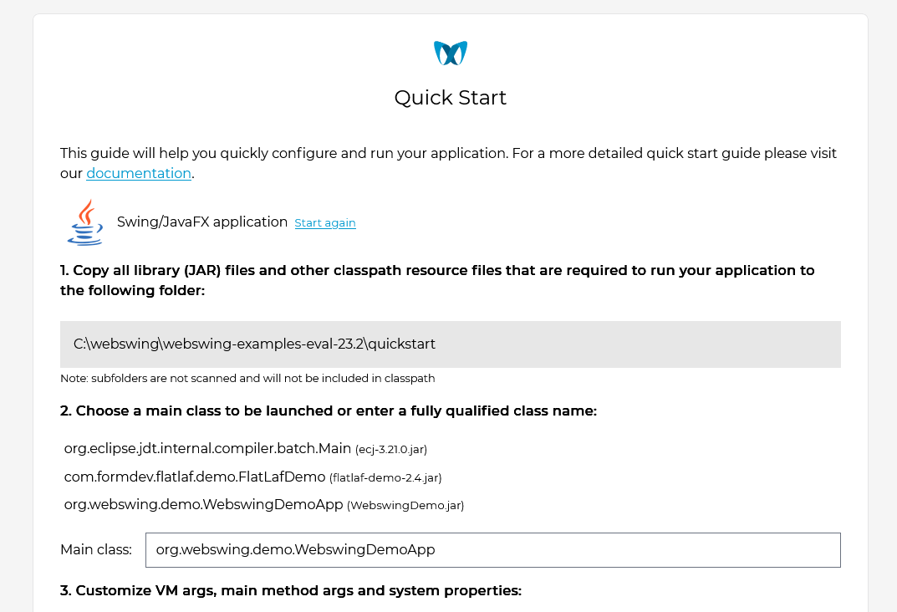
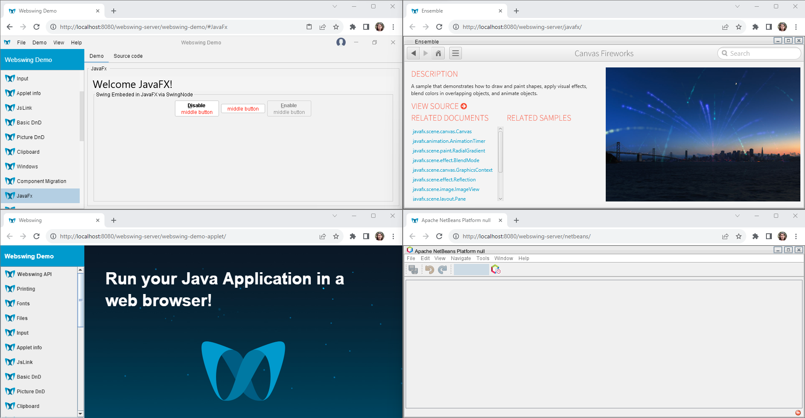

# Webswing

Webswing is a web server that allows you to run your old Swing, JavaFX, NetBeans or Applet application inside your web browser in a blink of an eye. The best days of Java UI frameworks are gone. Desktop applications lost popularity and everything is forced to be online and mobile. Question is, what should you do with your existing applications then? Using Applet technology proved to be insecure and rewriting the application to web is often too expensive. This is where Webswing can help you. With Webswing, your application is securely running on a server and user's browser only displays the application window. All this without changing a single line of source code. You can literally set up Webswing in 3 basic steps, usually within minutes.

## Quick start

Running your application with Webswing is a matter of minutes. Check out our [quick start guide](https://www.webswing.org/docs/latest/start/quickstart.html) in documentation or use our interactive quick start guide when you start Webswing server. Make sure to check out our helpful videos in our [YouTube channel](https://www.youtube.com/@webswing).

## Download and deploy your app

Simply [download Webswing](https://www.webswing.org/en/downloads) and deploy your application. Doesn't matter if it's Swing, JavaFX, Applet or a NetBeans application!

## Support

We're always here to help you with anything, just [let us know](https://www.webswing.org/en/contact).